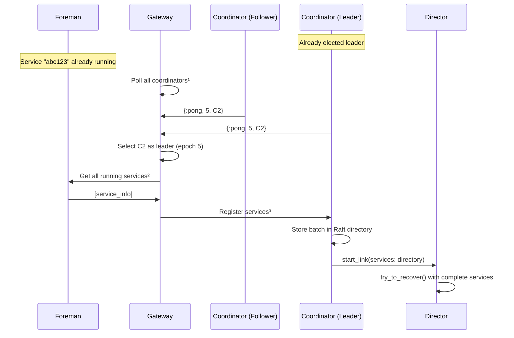
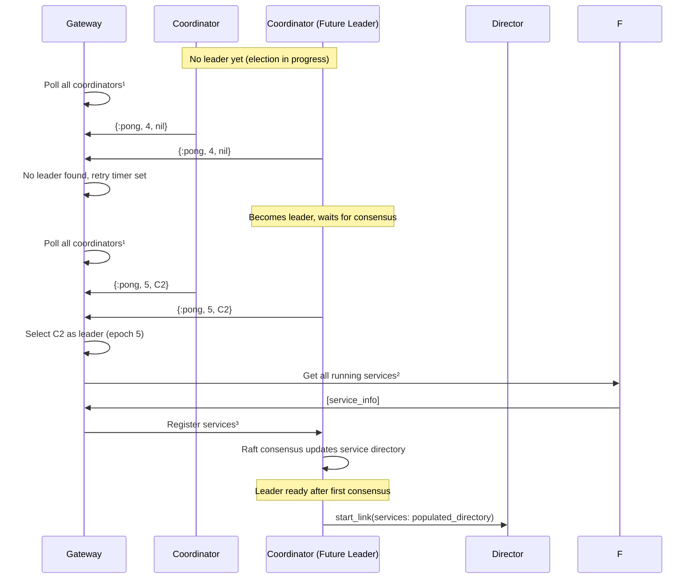
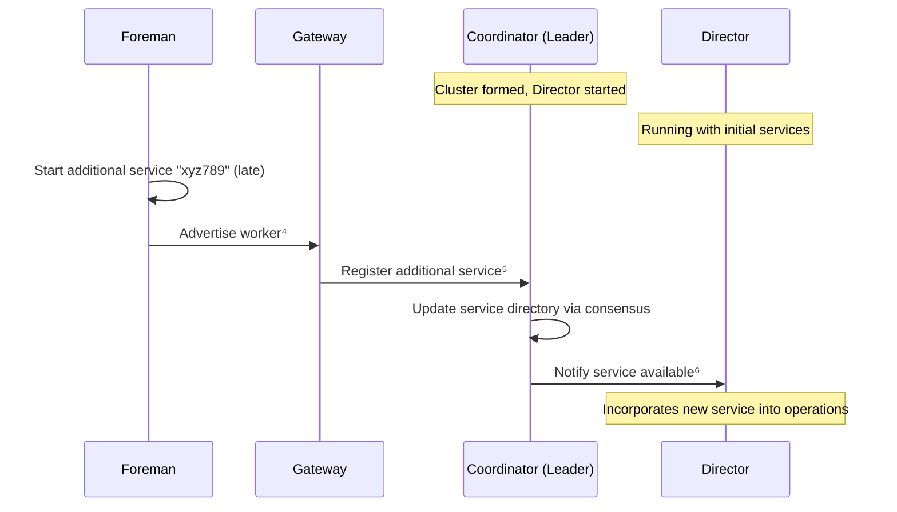
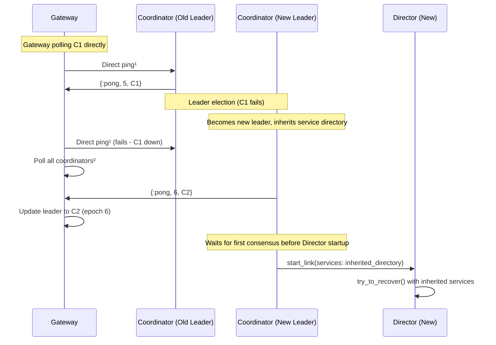
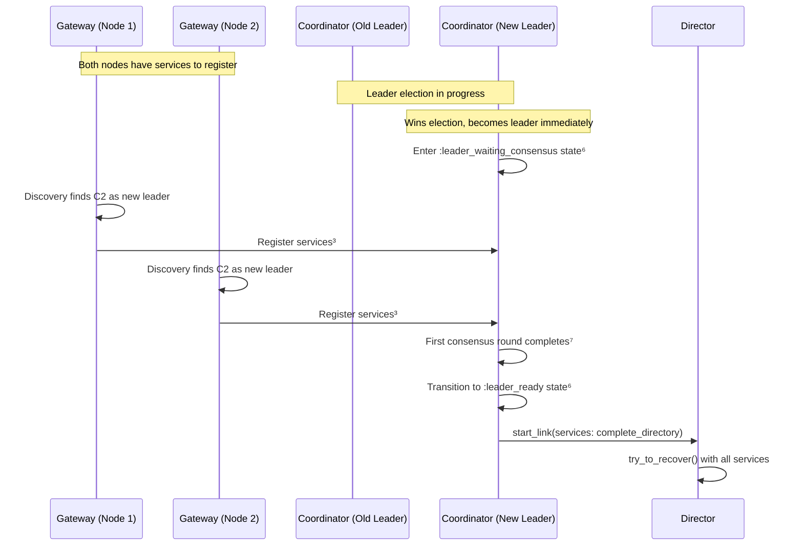

# Cluster Startup

**How Bedrock clusters come online: from individual nodes to coordinated system.**

Cluster startup establishes the prerequisites for recovery: elected leadership, complete service topology, and coordinated timing. The process involves Gateway, Coordinator, Director, and Foreman components working together through various timing scenarios.

## Coordination Requirements

Bedrock nodes must establish two critical elements before recovery can begin:

1. **Leadership Authority** - Which Coordinator has authority to make cluster-wide decisions
2. **Service Topology** - Complete inventory of resources across all nodes

The cluster startup system uses a pull-based pattern to coordinate these elements across cold starts, leader elections, and failover scenarios.

## Architecture

Cluster formation uses a pull-based pattern where components actively discover each other rather than relying on push notifications. The Raft leader Coordinator maintains authoritative cluster state while Gateway discovers the leader and registers local services in batches. All cluster state changes propagate through Raft consensus, ensuring the Director only starts after cluster state is fully established.

## Startup Scenarios

### Cold Startup with Established Leader

When nodes boot into a cluster with an established leader, the Gateway must discover which coordinator is the leader and register the node's services. The Gateway polls all coordinators simultaneously, selecting the leader based on the highest epoch response. This parallel polling is efficient because all coordinators can respond immediately - followers know who the leader is, and the leader identifies itself. Once the Gateway identifies the leader, it pulls all services from the local Foreman and registers them as a batch. This bulk registration ensures the Director starts with complete service information, avoiding the race condition where recovery begins before services are known.

*¹ `GenServer.multi_call(nodes, :coordinator, :ping, timeout)`  
*² `Foreman.get_all_running_services(timeout: 1_000)`  
*³ `Coordinator.register_gateway(coordinator, pid, services, capabilities)`

### Cluster Formation During Leader Election

When nodes boot during a leader election, the Gateway encounters a more complex scenario. Initially, all coordinators return `nil` for the leader field because the election is still in progress. The Gateway sets a retry timer and continues polling until leadership emerges. This polling strategy is resilient because it doesn't assume any particular timing - the Gateway simply waits for the cluster to stabilize. Once a coordinator wins the election, it increments the epoch and reports itself as leader. However, the critical timing issue emerges here: the new leader must wait for its first consensus round to receive service registrations from other nodes before starting the Director. This prevents the race condition where recovery begins with an incomplete service directory.

*¹ `GenServer.multi_call(nodes, :coordinator, :ping, timeout)`  
*² `Foreman.get_all_running_services(timeout: 1_000)`  
*³ `Coordinator.register_gateway(coordinator, pid, services, capabilities)`

### Late Service Startup

Sometimes services start slowly during cluster formation, arriving after the initial coordination has completed. In this scenario, the cluster establishes leadership and initial nodes register their services, allowing the leader to start a Director. However, additional services may still be starting up on various nodes. When these late-arriving services come online, the local Foreman advertises them to the Gateway, which registers them with the leader. The leader updates the service directory through consensus and notifies the Director, allowing it to incorporate the newly available resources.

*⁴ Internal Foreman notification to Gateway  
*⁵ `Coordinator.register_services(coordinator, [service_info])`  
*⁶ `GenServer.cast(director, {:service_registered, service_info})`

### Leader Failover Handling

Leader failover presents the most complex coordination scenario because it combines leader election with service directory management. Initially, the Gateway polls the known leader directly for efficiency. When the leader fails, these calls fail, triggering the Gateway to fall back to discovery mode. This two-phase polling strategy optimizes for the common case while remaining resilient to failures. The new leader inherits the existing service directory through Raft state, which is crucial because services don't need to re-register after leader changes. However, the new leader still must wait for consensus confirmation before starting the Director to ensure the inherited service directory is current and consistent across the cluster.

*⁴ `GenServer.call(coordinator, :ping, timeout)`  
*⁵ `GenServer.multi_call(nodes, :coordinator, :ping, timeout)`

### The Race Condition: Leader Election with Service Registration

The most subtle timing issue occurs when a new leader is elected while other nodes are simultaneously trying to register services. Without proper coordination, the new leader starts a Director immediately upon election, but service registrations from other nodes haven't yet propagated through Raft consensus. This creates a race where recovery begins with an incomplete service directory despite services being available on other nodes.

*⁶ `put_leader_startup_state/2` in Coordinator state management  
*⁷ `:raft, :consensus_reached` message triggers Director startup

## Startup Completion

Cluster startup completes when the system establishes stable leadership through Raft election, forms complete cluster topology through service registration and consensus, and coordinates readiness timing to prevent race conditions. The Coordinator then starts a Director with complete knowledge of available resources, and recovery begins.

## See Also

- [Recovery Guide](recovery-guide.md) - Recovery process that follows cluster formation
- [Components Quick](../00-quick/components-quick.md) - Component interaction overview
- `Bedrock.ControlPlane.Coordinator` - Cluster state management
- `Bedrock.DataPlane.Gateway` - Node integration and service registration