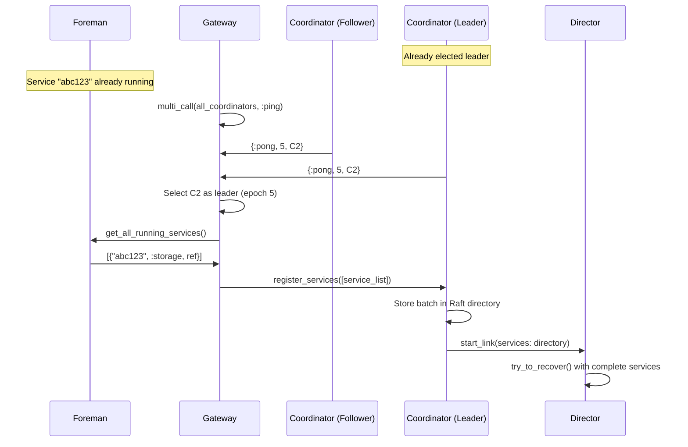
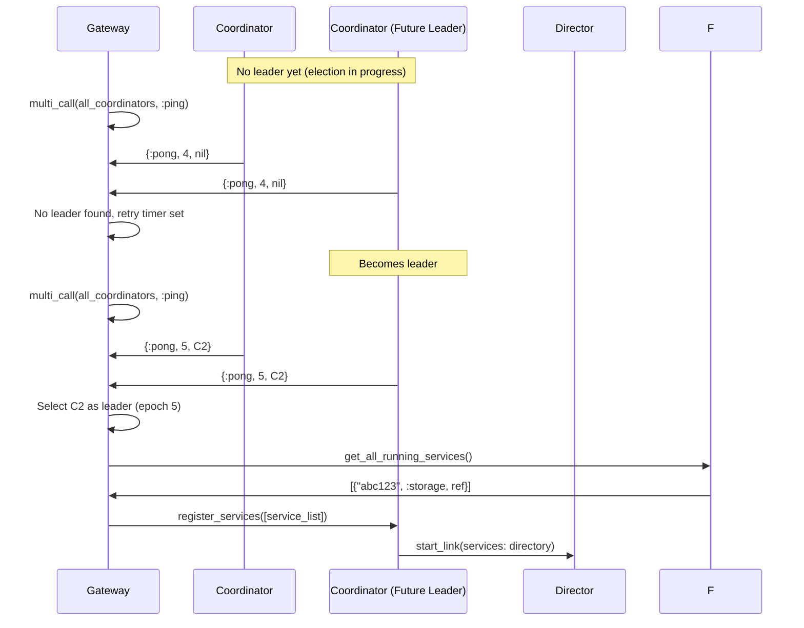
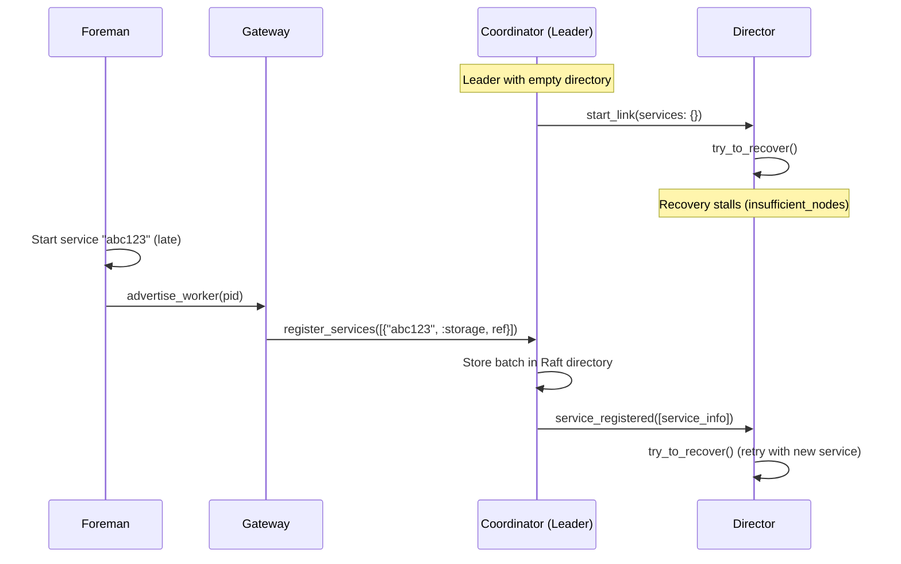
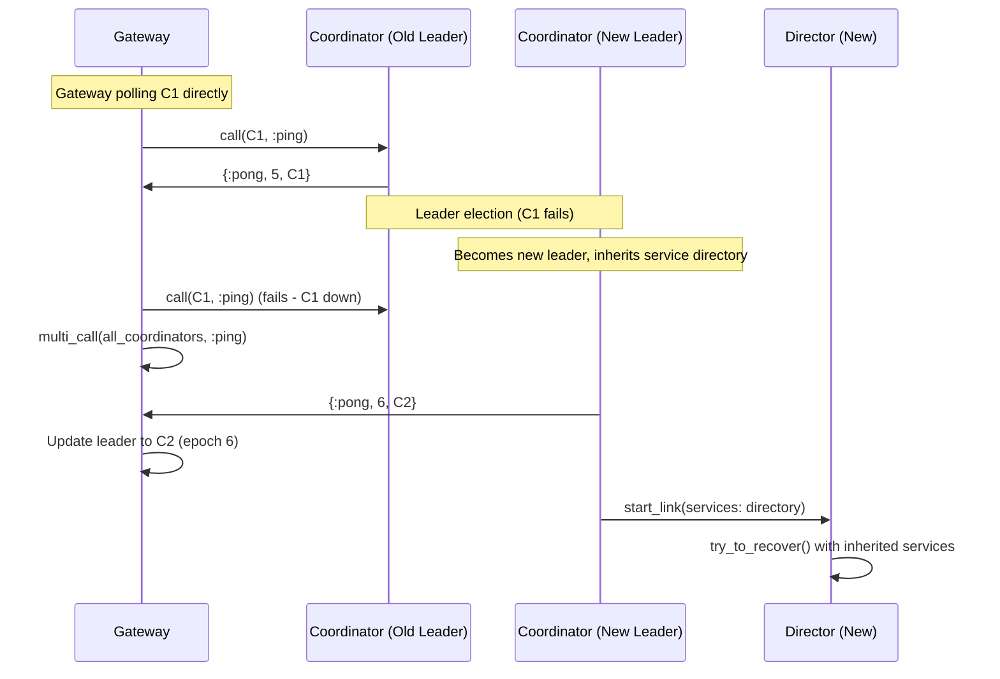

# Recovery Guide

**Comprehensive recovery patterns and troubleshooting for Bedrock's distributed system.**

See `Bedrock.ControlPlane.Director.Recovery` module documentation for complete implementation details.

## See Also
- `lib/bedrock/control_plane/director/recovery.ex` - Main recovery orchestrator
- `lib/bedrock/control_plane/director/recovery/` - Individual phase implementations  
- `lib/bedrock/control_plane/config/recovery_attempt.ex` - Recovery state management

## Recovery Overview

Bedrock's recovery system orchestrates the complex coordination required to bring a distributed database cluster from a failed or starting state to full operation. The process involves multiple components working together through well-defined phases, with robust handling of timing dependencies and failure scenarios.

### Key Concepts
- **Fail-Fast Philosophy**: Combines Erlang/OTP "let it crash" with FoundationDB fast recovery - use `Process.monitor/1` rather than complex health checking, with immediate failure response
- **Epoch-Based Management**: Prevents split-brain with generation counters - each recovery increments an epoch, processes terminate themselves when they detect newer generations  
- **Linear State Machine**: 18-phase recovery process from start through completion, with branch point for new vs existing clusters
- **Component Monitoring**: Any transaction component failure triggers immediate director exit and full recovery restart

## When Recovery Triggers

### Critical Components (Recovery Triggers)
Recovery is triggered when any of these components fail:
- **Coordinator**: Raft consensus failure or network partition
- **Director**: Recovery coordinator failure
- **Sequencer**: Version assignment failure
- **Commit Proxies**: Transaction batching failure
- **Resolvers**: Conflict detection failure
- **Transaction Logs**: Durability system failure

### Non-Critical Components (No Recovery)
These failures do NOT trigger recovery:
- **Storage Servers**: Data distributor handles storage failures
- **Gateways**: Client interface failures are handled locally
- **Rate Keeper**: Independent component with separate lifecycle

### Detection Mechanisms
- **Coordinator Failure**: Raft heartbeat timeout → Leader election
- **Director Failure**: `Process.monitor/1` → Coordinator restart with incremented epoch
- **Component Failure**: Director monitors ALL transaction components → ANY failure → Director immediate exit

### Node Rejoin Triggers Recovery
When nodes restart and advertise existing services, the Director restarts recovery to incorporate the rejoining resources. This ensures optimal service layout and prevents the complexity of incremental service integration during active recovery phases.

## Durable Services and Epoch Management

### Durable Service Nature
Logs and storage servers are **durable by design**:
- **Purpose**: Persist data across cold starts and node restarts
- **Lifecycle**: Survive node restarts, director failures, and epoch changes
- **Local Startup**: When node boots, it starts locally available durable services
- **Cluster Integration**: Services advertise to cluster via `request_to_rejoin`

### Epoch-Based Split-Brain Prevention
Durable services use epoch management to prevent split-brain scenarios:
- **Service Locking**: Director locks services with new epoch during recovery
- **Old Epoch Services**: Services with older epochs stop participating
- **New Epoch Services**: Only services locked with current epoch participate
- **Fail-Safe**: Services refuse commands from directors with older epochs

### Node Rejoin Flow
1. **Local Service Startup**: Node boots durable services from local storage
2. **Service Advertisement**: Services advertise through Gateway to Coordinator service directory  
3. **Recovery Restart**: Director detects new services and restarts recovery
4. **Integrated Discovery**: New services are incorporated through the standard service discovery process described above

## Recovery Process

### Coordinator Election and Director Startup
When coordinator fails, remaining coordinators detect failure via Raft heartbeat timeout and elect a new leader. The new coordinator reads persistent configuration from storage, initializes with the highest epoch, and starts a new director with incremented epoch. Any existing director detects the newer epoch and exits.

### Service Discovery and Coordination

Before recovery begins, service discovery establishes the foundation by building a complete picture of available cluster resources through coordination between Gateway, Coordinator, Director, and Foreman components. The process handles various timing scenarios gracefully, from normal startup to leader elections and dynamic service registration.

#### Discovery Architecture

The discovery flow follows a pull-based pattern where the Gateway actively queries for services rather than relying on push notifications. This eliminates timing-dependent race conditions during cluster startup:

- **Coordinator Authority**: The Raft leader coordinator maintains the authoritative service directory
- **Gateway Discovery**: Gateway discovers the leader using enhanced polling with epoch-based selection
- **Bulk Registration**: Gateway queries Foreman for all running services and registers them in batches
- **Director Integration**: Director receives complete service directory from coordinator before starting recovery

#### Discovery Interaction Patterns

**Normal Startup with Available Leader**

When the cluster starts with an established leader, service discovery proceeds smoothly:

The Gateway uses `multi_call` to poll all coordinators simultaneously, selecting the leader based on the highest epoch response. Once identified, the Gateway pulls all services from the Foreman and registers them as a batch, ensuring the Director starts with complete service information.

**Discovery During Leader Election**

When no leader is initially available, the Gateway polls until one emerges:

The Gateway's polling strategy gracefully handles leader election timing by continuously retrying until a coordinator reports a non-nil leader. This approach eliminates push-based timing dependencies.

**Late Service Registration**

Services that start after the Director begins recovery are handled through real-time updates:

When the Director encounters insufficient services, it enters a stalled state. Late-arriving services trigger service registration events that notify the Director to retry recovery with the expanded service set.

**Leader Failover Handling**

Leader changes are detected through polling failures that trigger discovery mode:

The Gateway employs a two-phase polling strategy: direct calls to known leaders for efficiency, falling back to discovery mode when direct calls fail. The new leader inherits the service directory through Raft state, ensuring continuity.

#### Service Locking and Epoch Management

Once the Director receives the complete service directory, it proceeds to lock services using the established epoch-based protocol:

1. **Service Selection**: Director identifies services needed for the transaction system layout
2. **Epoch Locking**: Services are locked with the current epoch to prevent split-brain scenarios  
3. **Legacy Termination**: Services with older epochs detect the newer epoch and terminate
4. **Capability Collection**: Director gathers service capabilities and health status

Once service discovery completes, the Director receives the complete service directory and begins the formal 18-phase recovery state machine.

### Recovery State Machine

The recovery process follows a linear state machine through these phases:

#### Phase 1: Startup (`StartupPhase`)
Records the exact timestamp when recovery begins and provides timing baseline for recovery duration metrics. Always succeeds and transitions to service locking.

#### Phase 2: Locking (`LockingPhase`)
Establishes exclusive director control by selectively locking services from the old system layout. Services are locked to prevent split-brain scenarios where multiple directors attempt concurrent control. Only services referenced in the old transaction system layout are locked - these contain data that must be copied during recovery.

**Branch Point**: The recovery path is determined by what gets locked:
- **Nothing locked** → First-time initialization (new cluster)
- **Services locked** → Recovery from existing data

#### Phase 3a: Initialization (`InitializationPhase`)
Creates the initial transaction system layout for a new cluster when no previous cluster state exists. Creates log descriptors with evenly distributed key ranges and storage teams with the configured replication factor using vacancy placeholders.

#### Phase 3b: Log Discovery (`LogDiscoveryPhase`)
For existing clusters, finds logs that need to be recovered from the previous system layout.

#### Phase 4: Version Determination (`VersionDeterminationPhase`)
Finds the highest committed version across all logs to establish the consistent recovery point.

#### Phase 5: Vacancy Creation (`VacancyCreationPhase`)
Creates placeholders for missing services that need to be filled during recruitment phases.

#### Phase 6: Log Recruitment (`LogRecruitmentPhase`)
Assigns or creates log workers to fill the vacancy placeholders created in the previous phase.

#### Phase 7: Storage Recruitment (`StorageRecruitmentPhase`)
Assigns or creates storage workers to fill storage team vacancy placeholders.

#### Phase 8: Log Replay (`LogReplayPhase`)
Replays transactions from old logs to ensure all committed transactions are applied to the new system.

#### Phase 9: Data Distribution (`DataDistributionPhase`)
Fixes data distribution across storage servers to ensure proper sharding and replication.

#### Phase 10: Sequencer Startup (`SequencerStartupPhase`)
Starts the sequencer component responsible for version assignment.

#### Phase 11: Proxy Startup (`ProxyStartupPhase`)
Starts commit proxy components that batch transactions and coordinate commits.

#### Phase 12: Resolver Startup (`ResolverStartupPhase`)
Starts resolver components that implement MVCC conflict detection.

#### Phase 13: Validation (`ValidationPhase`)
Performs final validation before Transaction System Layout construction. Conducts comprehensive checks to ensure all transaction system components are properly configured and ready for TSL construction.

#### Phase 14: Transaction System Layout (`TransactionSystemLayoutPhase`)
Constructs the Transaction System Layout, the critical blueprint defining how the distributed system operates. Builds the complete system topology containing sequencer, commit proxies, resolvers, logs, storage teams, and service descriptors. Unlocks all services in parallel to prepare them for transaction processing.

#### Phase 15: Persistence (`PersistencePhase`)
Constructs a system transaction containing the full cluster configuration and submits it through the entire data plane pipeline. This simultaneously persists the new configuration and validates that all transaction components work correctly.

#### Phase 16: Monitoring (`MonitoringPhase`)
Sets up monitoring of all transaction system components using `Process.monitor/1`. Any failure of critical components will trigger immediate director shutdown and recovery restart, implementing Bedrock's fail-fast philosophy.

#### Phase 17: Cleanup (`CleanupPhase`)
Cleans up unused workers that are no longer needed in the new system layout.

#### Phase 18: Recovery Complete
Recovery is marked as complete and the system transitions to operational mode.

### Key Implementation Points
- **Director monitors ALL transaction components**
- **ANY component failure → Director immediate exit**
- **Coordinator uses simple exponential backoff**
- **No circuit breaker complexity**
- **Epoch-based generation management**
