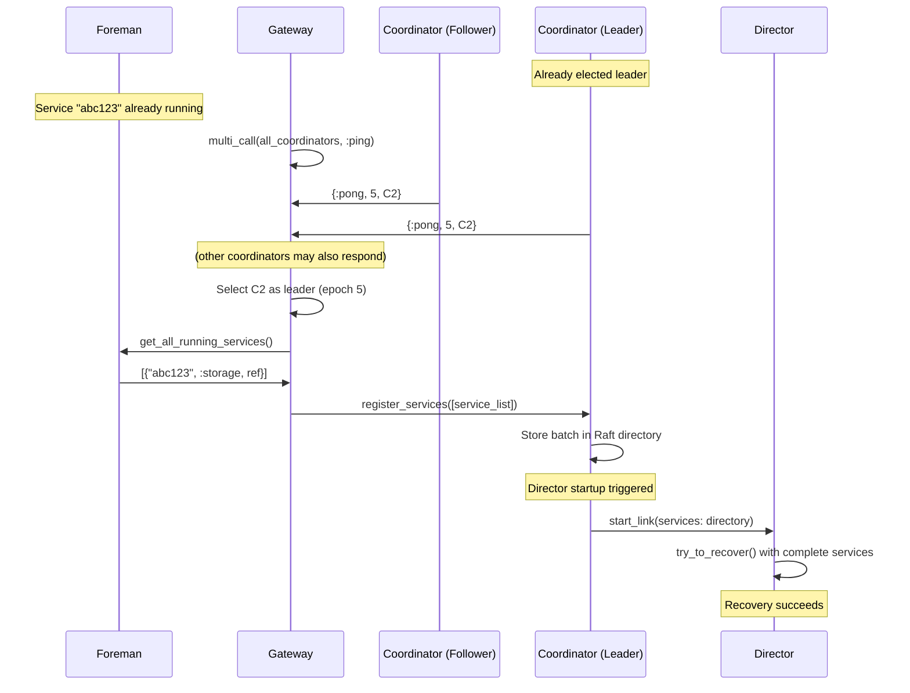
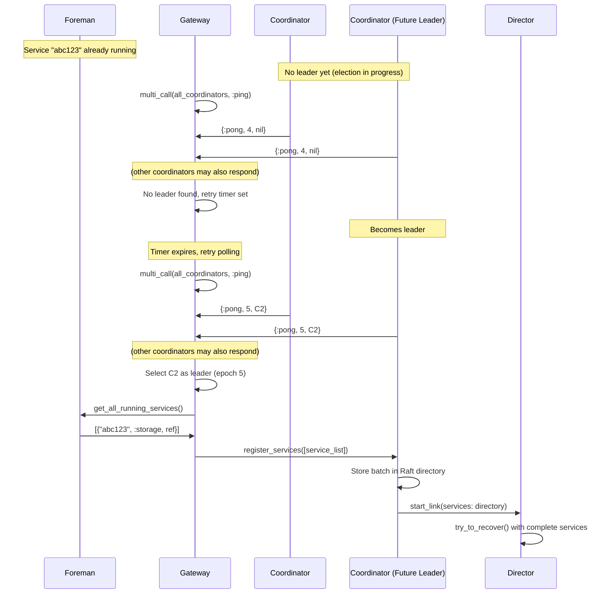
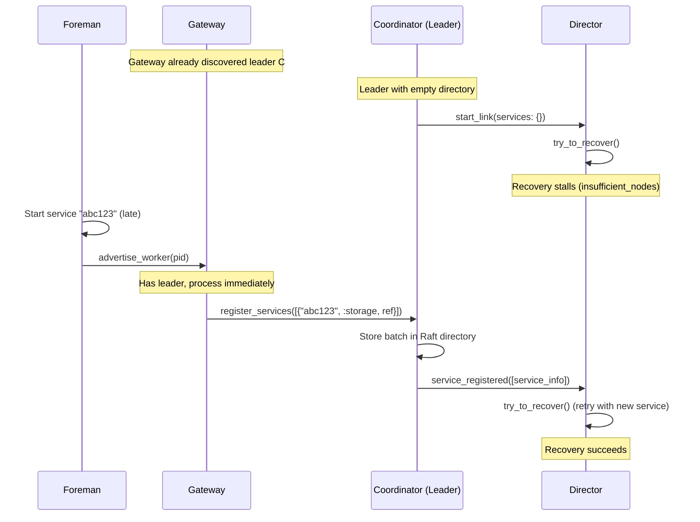
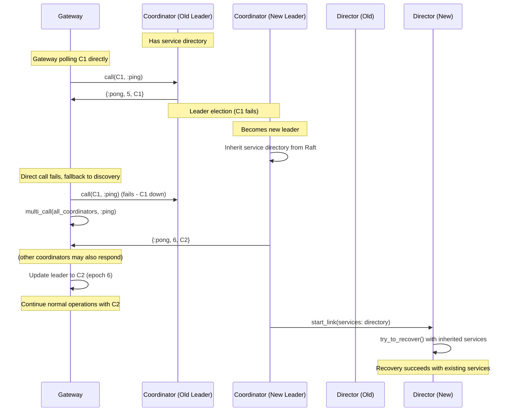

# Service Discovery Race Condition: Design Document

## Problem Statement

The current Bedrock service discovery system has race conditions during cluster startup that cause recovery to stall indefinitely. The core issue is that when a Director starts, it may not have complete service information, leading to `{:insufficient_nodes, needed, available}` stalls that are never retried when new services become available.

## Root Cause Analysis

1. **Asynchronous Service Advertisement**: Foremen advertise services to gateways, which forward to directors, but this happens asynchronously with director startup
2. **Missing Leader Coordination**: Gateways connect to any available coordinator, not necessarily the leader who starts the director
3. **No Service Persistence**: Service advertisements are ephemeral - if lost during startup, they're never retried
4. **Incomplete Retry Logic**: Stalled recovery doesn't restart when new nodes/services join

## Proposed Solution

### Core Design Principles
1. **Coordinator Leader as Service Authority**: The Raft leader coordinator maintains the authoritative service directory as a simple map of `service_id → {kind, worker_ref}` with no liveness tracking
2. **Enhanced Polling-Based Leader Discovery**: Gateway uses existing multi_call pattern with epoch-based leader information
3. **Deterministic Director Startup**: Director receives complete service directory from leader before starting recovery

### Discovery Flow Changes

**Current (Push-on-Boot - Race Prone)**: Foreman immediately advertises all services to gateway on startup, but gateway may not have discovered a leader yet, causing advertisements to be lost.

**Proposed (Pull-on-Leader - Race Free)**: Gateway first discovers the leader coordinator, then actively queries foreman for all running services and bulk registers them. New service notifications from foreman are ignored when no leader is available and processed immediately when a leader is known.

**Enhanced Leader Discovery**:

The gateway enhances existing multi_call polling by having coordinators return leader information with their epoch number. The two-phase strategy uses multi_call for discovery when no leader is known, then switches to direct calls for monitoring known leaders. When direct calls fail, it automatically falls back to discovery mode.

Leader selection filters coordinator responses for non-nil leaders and chooses the highest epoch response, ensuring connection to the most current leader during transitions. This builds on proven patterns while eliminating push notification complexity.

**Batched Registration**: The registration API consistently accepts service lists for single or multiple registrations, ensuring all operations result in a single Raft command to reduce consensus overhead.

## Interaction Scenarios

### Scenario 1: Normal Startup with Leader Available

### Scenario 2: Gateway Polling During Leader Election

### Scenario 3: Late Service Registration After Director Start

### Scenario 4: Leader Change Detected by Polling

## Implementation Plan

### Phase 1: Coordinator Service Directory (Major Changes)

**Goal**: Add service directory to Raft state, enhance coordinator ping response to include leader information, add batched service registration commands, modify director startup to pass complete service directory, handle leadership changes with service directory transfer, add director notification system to push service updates to running director.

**Tasks:**
1. **Service Directory Storage**
   - Add service_directory field to coordinator state structure
   - Initialize service_directory as empty map in coordinator init
   - Ensure service_directory persists across coordinator restarts via Raft state

2. **Raft Commands**
   - Create register_services command handler that accepts list of service info tuples
   - Create deregister_services command handler that accepts list of service IDs
   - Add command validation to ensure service info contains required fields (id, kind, worker_ref)

3. **Enhanced Ping Response**
   - Modify existing ping handler to include leader information
   - Format response as {:pong, epoch, leader_pid_or_nil}

4. **Director Integration**
   - Modify director startup call to include complete service_directory from coordinator state
   - Add director PID tracking in coordinator state for push notifications
   - Implement service update notification to running director when services are registered
   - Handle director process monitoring to clean up tracking when director terminates

### Phase 2: Foreman Query API (Required for Phase 3)

**Goal**: Add bulk service query API to support gateway pull-based discovery.

**Tasks:**
1. **Bulk Service Query API**
   - Add get_all_running_services function that returns list of all healthy worker info
   - Ensure returned service info matches format expected by coordinator registration
   - Filter results to only include workers that are currently healthy and running
   - Format worker info to include service ID, kind, and worker reference

**Note**: Existing worker advertisement logic continues unchanged - no modifications to worker lifecycle.

### Phase 3: Gateway Leader Discovery (Minor Changes)

**Goal**: Enhance existing coordinator discovery to handle enhanced ping responses with leader info, add leader selection logic to prefer actual leader over follower responses, add pull-based service discovery from foreman when leader becomes available, update service registration flow to use batched registration API, ignore service notifications when no leader available.

**Tasks:**
1. **Leader Discovery Enhancement**
   - Update existing multi_call ping to handle enhanced pong response
   - Rename coordinator field to known_leader for clarity
   - Implement two-phase polling: direct call when leader known, multi_call for discovery
   - Add leader selection logic that chooses highest epoch response with non-nil leader

2. **Service Registration Flow**
   - Add trigger to query foreman when leader becomes available
   - Implement foreman query call to get all currently running services
   - Update service advertisement handling to use batched register_services call
   - Ignore service notifications when no known_leader available
   - Implement immediate registration when leader is known
   - Handle leader change by re-querying foreman

### Phase 4: Director Service Integration (Moderate Changes)

**Goal**: Accept initial service directory in startup parameters, add service update handler to receive real-time service notifications from coordinator, add stalled recovery retry logic to detect when new services resolve insufficient_nodes conditions, modify recovery startup to use provided services instead of ping-based discovery.

**Tasks:**
1. **Service Directory Integration**
   - Modify director initialization to accept initial services parameter from coordinator
   - Update director state to store provided services instead of relying on ping-based discovery
   - Remove or modify existing service discovery logic that conflicts with coordinator-provided services

2. **Real-Time Service Updates**
   - Add handle_cast handler for service_registered notifications from coordinator
   - Implement logic to add new services to director's known services map
   - Add retry trigger for stalled recovery when new services might resolve insufficient_nodes error
   - Ensure service updates are properly integrated with existing recovery state management

3. **Recovery Retry Logic**
   - Identify recovery stall conditions that could be resolved by new services
   - Add try_to_recover call when service updates are received during stalled recovery
   - Ensure retry logic doesn't conflict with existing recovery attempt management
   - Handle race conditions between recovery completion and service updates

### Phase 5: End-to-End Testing
1. Test complete service registration flow from foreman through gateway to coordinator
2. Verify director startup with complete service directory
3. Test late service registration scenarios with recovery retry
4. Verify leader change handling and service directory inheritance
5. Performance testing of batched registration vs individual calls

## Key Benefits

1. **Simple**: Service directory is just a lookup table - no complex liveness tracking
2. **Robust**: Raft persistence survives leader changes, deterministic director startup  
3. **Fast**: Efficient polling with proven timeout handling - leverages existing robust patterns
4. **Efficient**: Batched registration reduces Raft traffic and consensus rounds
5. **Timing-Independent**: Pull-based discovery eliminates boot race conditions
6. **Self-Healing**: Stalled recovery automatically retries when new services become available

## Failure Handling

### Dead Services
- **Lock timeouts handle dead processes**: Recovery's existing lock mechanism times out quickly on dead services
- **No directory cleanup needed**: Failed locks are ignored, recovery proceeds with available services
- **Natural cleanup**: Services are removed from directory when explicitly deregistered

### Network Partitions  
- **Raft prevents split-brain**: No leader election without quorum, no recovery without leader
- **Consistent service directory**: Only committed Raft entries are visible to directors
- **Automatic healing**: Services re-register when partitions resolve

### Coordinator-Director Communication
- **Real-time updates**: Coordinator pushes service changes to running director
- **Stalled recovery retry**: Director automatically retries when new services resolve insufficient_nodes
- **Consistency window handling**: Late-arriving services trigger recovery retry after director startup

## Risk Mitigation

- **Incremental Implementation**: Each phase is independently testable
- **Fallback Mechanisms**: Existing ping-based discovery remains until fully replaced
- **Testing Strategy**: Unit tests for each component, integration tests for scenarios
- **Rollback Plan**: Changes can be reverted phase by phase if issues arise

This design eliminates timing-dependent coordination by making the leader coordinator the authoritative source of service information and using enhanced polling-based leader discovery to ensure all components have consistent, complete service knowledge.