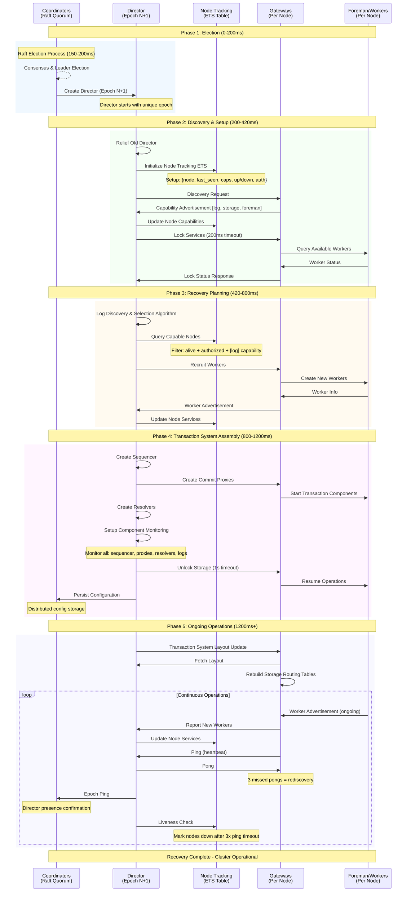

# Bedrock Recovery: Component Interactions Flow

This document maps out the complete recovery interaction between components as it currently exists in the Bedrock codebase, from initial coordinator election through full cluster recovery.

## Overview

Recovery in Bedrock follows a multi-stage process:

1. **Raft Election** among coordinator quorum 
2. **Director Creation** by newly elected leader
3. **Gateway Discovery** and node registration
4. **Multi-Phase Recovery** orchestrated by the director
5. **Component Monitoring** and health supervision

## Key Components

- **Coordinators**: Raft consensus cluster that elects leaders and manages cluster configuration
- **Directors**: Recovery orchestrators created by coordinator leaders with unique epochs
- **Gateways**: Node-level cluster interface for service discovery and worker advertisement
- **Node Tracking**: ETS-based system tracking node capabilities, liveness, and authorization
- **Transaction Components**: Sequencers, commit proxies, resolvers, logs, and storage workers

## Recovery Timeline Sequence Diagram

The following timeline diagram shows the chronological sequence of interactions during recovery:

**Recovery Phases Summary:**

- **Phase 1 (0-200ms)**: Raft election among coordinators, leader creates director with incremented epoch
- **Phase 2 (200-420ms)**: Director relief, node discovery, capability advertisement, service locking
- **Phase 3 (420-800ms)**: Log discovery, worker recruitment using node tracking capabilities
- **Phase 4 (800-1200ms)**: Transaction component creation, monitoring setup, storage unlocking, config persistence
- **Phase 5 (1200ms+)**: Ongoing heartbeat monitoring, worker advertisement, failure detection

## Phase 1: Coordinator Election and Leadership

### Raft Election Process

**Location**: `coordinator/server.ex:125-141`, `coordinator/raft_adapter.ex:28-30`

The coordinator cluster uses Raft consensus to elect a leader, with election timeouts set to 150-200ms (including up to 50ms jitter) and heartbeat intervals of 50ms. The system leverages an external `bedrock_raft` library to handle the core consensus logic.

When a leadership change occurs, the coordinator receiving the notification immediately updates its internal state to reflect the new leader. All coordinators then stop any directors running on their local node to ensure a clean slate. If the coordinator discovers it has become the new leader, it automatically initiates the creation of a fresh director.

The election can result in two outcomes: either the leadership remains undecided (in which case all directors are stopped), or a specific node becomes the new leader (triggering director cleanup followed by new director creation on the leader node).

## Phase 2: Director Creation and Epoch Management

### Director Lifecycle Management

**Location**: `coordinator/controller_management.ex:24-46` (Note: renamed from DirectorManagement)

Only the coordinator leader creates directors, and each new director receives an incremented epoch number to ensure proper ordering and prevent conflicts. When the coordinator attempts to start a director, it launches the process under supervision and immediately begins monitoring it for failures.

The director creation process includes a relief mechanism where the new director is informed about any existing director it should replace. This handoff information includes the epoch of the old director and its process identifier, enabling a clean transition of responsibilities.

The supervision strategy uses a temporary restart approach, meaning the coordinator itself handles director restarts rather than relying on OTP supervision trees. When a director fails, the coordinator detects this through process monitoring and schedules a restart using exponential backoff (starting at 1 second and capping at 30 seconds) to prevent rapid restart loops during persistent failures.

## Phase 3: Gateway Discovery and Node Registration

### Gateway Startup and Discovery

**Location**: `cluster/gateway/server.ex:54-89`, `cluster/gateway/discovery.ex`

Every node in the cluster runs a Gateway process that serves as the primary interface to the control plane. Each gateway maintains its own state including cluster information, node capabilities, and an ETS table for transaction routing. Gateways operate in either active mode (with specific capabilities like log or storage) or passive mode (basic cluster participation only).

When a gateway starts, it immediately begins a two-step discovery process. First, it attempts to find any live coordinator by pinging all known coordinator nodes until one responds. Once it successfully contacts a coordinator, the gateway proceeds to the second step: discovering the current director by querying the coordinator for director information.

This discovery process includes automatic retry logic with timers, ensuring that gateways continue attempting to connect even when the control plane is temporarily unavailable during cluster startup or recovery scenarios.

### Node Registration and Capability Advertisement

**Location**: `cluster/gateway/director_relations.ex:80-98`

When a gateway successfully connects to a director, it immediately begins the node registration process by advertising its capabilities and current state. The gateway first gathers information about any workers currently running on its node through the local Foreman service, then sends this complete picture to the director.

The registration request includes the node's advertised capabilities (such as log, storage, or foreman capabilities) along with detailed information about any services already running on the node. This allows the director to understand both what the node can do and what it's currently doing, enabling informed decisions during recovery planning.

### Node Tracking System

**Location**: `director/node_tracking.ex:33-46`, `director/nodes.ex:21-35`

The director maintains a comprehensive ETS table that tracks the state of all cluster nodes. Each node entry includes information about when it was last seen, its advertised capabilities, whether it's currently up or down, its authorization status, and its minimum read version for transaction consistency.

When the director receives a node rejoin request, it first ensures the node exists in the tracking table (adding it if necessary), then updates the node's last-seen timestamp and capability information. The director only accepts running service information from nodes that are marked as authorized in the tracking system.

This centralized node tracking enables the director to make informed decisions about where to place new workers during recovery, ensuring that components are only created on nodes that have the necessary capabilities and are currently responsive.

## Phase 4: Director Initialization and Recovery Startup

### Director Server Initialization

**Location**: `director/server.ex:52-77`

When a director starts, it initializes with the cluster configuration, its assigned epoch, a reference to its coordinating process, and information about any previous director it should relieve. Each director generates a unique cryptographic lock token that will be used to ensure exclusive access to services during recovery.

The director immediately schedules the start of its recovery process, but first handles any necessary relief handoff. If there's a previous director that needs to be relieved, the new director sends a relief message containing its own epoch and process identifier. This ensures that the old director gracefully steps down and stops interfering with cluster operations.

Once the relief process completes, the director begins its recovery attempt and ensures that any configuration changes are persisted back to the coordinator for cluster-wide visibility.

## Phase 5: Multi-Phase Recovery Process

### Recovery State Machine

**Location**: `director/recovery.ex:78-174`

The recovery process follows a comprehensive state machine with over 15 distinct phases, each responsible for a specific aspect of cluster recovery. The phases progress sequentially, with each phase either completing successfully and advancing to the next phase, or encountering an error that causes the recovery to stall.

The recovery begins with basic initialization and service locking, then moves through data discovery phases where the director analyzes existing logs and determines what needs to be preserved. The middle phases handle the recruitment and creation of new workers as needed, followed by transaction system component creation (sequencers, proxies, resolvers). The final phases perform validation, persistence, monitoring setup, and cleanup of obsolete resources.

Each phase can potentially stall if it encounters insufficient resources, network failures, or other blocking conditions. When a phase stalls, the entire recovery attempt is marked with the stall reason, allowing operators to understand what needs to be addressed before recovery can proceed.

### Key Recovery Phases Detail

#### Phase 1: Start Phase
**Location**: `recovery/start_phase.ex:22-24`

The start phase simply records the current timestamp to mark when the recovery attempt began and immediately transitions to the service locking phase.

#### Phase 2: Service Locking Phase  
**Location**: `recovery/lock_services_phase.ex:29-44`

This critical phase attempts to lock all available storage and log services for the current epoch within a 200ms timeout window. The director contacts each service asynchronously, requesting that they lock themselves for recovery under the new epoch number. Services can reject the lock request if they're already locked by a newer epoch, which would indicate that another director is already handling recovery.

Based on the locking results and examination of any existing transaction system layout, the director makes a crucial decision about the recovery path. If no previous logs or storage exist, it proceeds with first-time initialization. If transaction components from a previous layout are detected but found to be stale (processes no longer alive), the director forces a fresh initialization. Otherwise, it proceeds with recovery from the existing state.

#### Phase 3: Log Discovery Phase
**Location**: `recovery/log_discovery_phase.ex:29-47`

During log discovery, the director analyzes the available logs from the previous transaction system layout to determine which ones should be copied for recovery. This involves a sophisticated selection algorithm that considers all possible combinations of logs that could satisfy the required quorum.

The algorithm extracts version vectors from each available log (representing the range from oldest to newest transaction versions), then generates all possible combinations that meet the quorum requirement. Each combination is evaluated by calculating the gap between the oldest and newest versions across the selected logs. The director chooses the combination that minimizes this gap, as it represents the most efficient recovery path with the least amount of transaction history to process.

#### Phase 7: Log Recruitment Phase (Node Tracking Integration)
**Location**: `recovery/log_recruitment_phase.ex:28-67`

The log recruitment phase demonstrates the tight integration between recovery and node tracking. When the director needs to fill log vacancies, it queries the node tracking system to find all nodes that are currently alive, authorized, and have advertised log capabilities.

The director first attempts to use existing log workers that aren't currently assigned. If insufficient existing workers are available, it calculates how many new workers need to be created and verifies that enough capable nodes are available. The director then distributes new worker creation across the available nodes, contacting each node's Foreman service to actually create the workers.

This capability-based recruitment ensures that log workers are only created on nodes that have explicitly advertised their ability to run log services, preventing deployment failures and ensuring optimal resource utilization.

#### Phase 8: Storage Recruitment Phase
**Location**: `recovery/storage_recruitment_phase.ex`

The storage recruitment phase follows the same pattern as log recruitment but targets nodes with storage capabilities. This ensures that storage workers are created on appropriate nodes that have the necessary resources and have been configured to handle storage workloads.

#### Phase 11: Sequencer Creation
**Location**: `recovery/sequencer_phase.ex:23-30`

The sequencer creation phase starts the transaction sequencer component, which is responsible for assigning global version numbers to transactions. The director creates the sequencer with the current epoch and the last committed version from the recovery's version vector, ensuring transaction ordering continuity.

#### Phase 12: Commit Proxy Creation
**Location**: `recovery/commit_proxy_phase.ex:24-44`

This phase creates the desired number of commit proxy components across available nodes. Commit proxies are responsible for batching transactions and coordinating their commits. The director distributes these proxies across multiple nodes for load balancing and fault tolerance, with each proxy receiving the current epoch and director information.

#### Phase 17: Component Monitoring Phase
**Location**: `recovery/monitoring_phase.ex:25-72`

In the final monitoring phase, the director establishes process monitoring for all transaction system components it has created. This includes the sequencer, all commit proxies, all resolvers, and all log workers. By monitoring these processes, the director can detect component failures immediately and trigger a new recovery if any critical component dies. Once monitoring is established, the recovery is marked as completed.

## Phase 6: Post-Recovery Operations

### Gateway Transaction System Layout Updates

**Location**: `cluster/gateway/director_relations.ex:46-78`

After recovery completes, gateways must update their understanding of the cluster topology by fetching the new transaction system layout from the director. This layout contains crucial routing information about which storage workers handle which key ranges, as well as information about all transaction components.

When a gateway receives the updated layout, it completely rebuilds its local storage routing table. This ETS table maps key ranges to specific storage worker processes, enabling the gateway to efficiently route read and write operations to the correct storage nodes. The rebuild process ensures that all old routing information is cleared and replaced with the current post-recovery topology.

### Worker Advertisement to Director

**Location**: `cluster/gateway/director_relations.ex:100-109`

When new workers are created during recovery, gateways play a crucial role in keeping the director informed about the cluster's actual state. The Foreman service notifies the local gateway whenever it creates a new worker, and the gateway immediately gathers detailed information about that worker and reports it to the director.

This creates an important feedback loop that ensures the director's view of the cluster remains accurate. As recovery creates new workers, they're immediately registered with the director, which can then incorporate them into the transaction system layout. When gateways subsequently fetch the updated layout, they receive routing information that includes these newly created workers, enabling proper transaction processing.

### Storage Unlocking
**Location**: `director/recovery.ex:124-139`

Once recovery completes successfully, the director must unlock all storage workers that were locked during the recovery process. Each storage worker receives the durable version information and the complete transaction system layout, allowing them to resume normal operations with the correct understanding of the cluster topology.

This unlocking process has a timeout of 1 second per storage worker, ensuring that the director doesn't wait indefinitely for unresponsive workers but still provides sufficient time for normal unlocking operations to complete.

### Configuration Persistence
**Location**: `director/server.ex:175-184`

Throughout the recovery process, the director makes numerous changes to the cluster configuration, including updates to the transaction system layout, service mappings, and epoch information. All of these changes must be written back to the distributed coordinator configuration to ensure cluster-wide visibility and persistence.

The director sends configuration updates to its coordinating process, which handles the distributed storage of this information across the coordinator cluster. This ensures that if the director fails and a new one takes over, it will have access to the most recent configuration state.

## Component Failure and Monitoring

### Gateway-Director Heartbeat System

**Location**: `cluster/gateway/director_relations.ex:148-201`

Gateways maintain continuous heartbeat communication with directors to detect failures and epoch changes. Each gateway periodically sends ping messages to its known director, including its minimum read version for transaction consistency tracking.

When a gateway doesn't receive the expected pong response, it increments a missed pong counter. After missing more than three consecutive pongs, the gateway concludes that the director has failed and automatically triggers rediscovery of the control plane.

Importantly, if a gateway receives a pong from a different director than the one it was previously connected to, it immediately switches to the new director. This mechanism allows gateways to automatically follow director changes that occur during coordinator failover and recovery scenarios.

### Director-Coordinator Heartbeat System

**Location**: `director/nodes.ex:43-54`

Directors maintain their presence in the coordinator cluster through periodic ping broadcasts to all coordinator nodes. These pings include the director's current epoch and process identifier, allowing coordinators to track which director is currently active and at what epoch level.

This heartbeat mechanism serves multiple purposes: it allows coordinators to monitor director health, enables coordinators to update their cached director information when they receive pings from new directors, and provides a way for coordinators to detect when they need to restart a failed director.

### Node Liveness Tracking

**Location**: `director/node_tracking.ex:52-78`, `director/nodes.ex:72-80`

The director continuously monitors node liveness through its node tracking system, using heartbeat timeouts to identify nodes that have become unresponsive. Nodes are considered "dying" if they haven't responded to pings within three times the configured ping rate, or if they've never responded at all.

When the director identifies dying nodes, it immediately marks them as down in the node tracking table and updates the status of all services running on those nodes to reflect their unavailability. This ensures that the director won't attempt to use services on failed nodes during recovery operations and provides accurate cluster state information for decision-making.

### Director Component Monitoring
**Location**: `director/server.ex:87-97`

Directors implement a "fail-fast" monitoring strategy for all transaction system components. Once a director establishes monitoring for sequencers, commit proxies, resolvers, and log workers, any failure of these critical components causes the director to immediately exit with a component failure reason.

This aggressive failure response ensures that partial transaction system failures don't lead to undefined behavior or data corruption. Instead, the entire transaction system is considered failed and must be recovered from scratch, maintaining system consistency.

### Coordinator Director Monitoring  
**Location**: `coordinator/controller_management.ex:96-110`

Coordinators monitor their directors and handle director failures through automatic restart with exponential backoff. When a coordinator detects that its director has failed, it marks the director as unavailable and schedules a restart attempt.

The restart scheduling uses exponential backoff starting at 1 second and increasing up to 30 seconds to prevent rapid restart loops when failures persist. This gives time for underlying issues to be resolved while ensuring that recovery attempts continue.

## Summary: Complete Recovery Flow

1. **Raft Election** (150-200ms): Coordinator quorum elects leader using external `bedrock_raft`
2. **Director Creation** (immediate): Leader creates new director with incremented epoch
3. **Gateway Discovery** (variable): Nodes discover coordinator/director and advertise capabilities
4. **Node Registration** (immediate): Directors track node capabilities, authorization, and liveness
5. **Service Locking** (200ms timeout): Director locks all available storage/log services  
6. **Log Discovery** (variable): Analyzes existing logs and selects optimal quorum
7. **Component Recruitment** (variable): Uses node tracking to recruit/create workers on capable nodes
8. **Transaction System Assembly** (variable): Creates sequencer, commit proxies, resolvers
9. **Component Monitoring** (immediate): Director monitors all transaction components
10. **Storage Unlocking** (1s timeout): Unlocks storage workers for normal operation
11. **Layout Distribution** (variable): Gateways fetch updated transaction system layouts
12. **Configuration Persistence** (variable): Saves final configuration to coordinator cluster

**Key Component Interactions**:

- **Coordinator ↔ Director**: Creation, monitoring, configuration persistence, relief handoff
- **Gateway ↔ Coordinator**: Discovery, heartbeat, failure detection, relief notification
- **Gateway ↔ Director**: Capability advertisement, worker advertisement, layout fetching, heartbeat
- **Director ↔ Node Tracking**: Node registration, capability tracking, liveness monitoring
- **Director ↔ Services**: Locking, recruiting, monitoring via Foreman
- **Director ↔ Transaction Components**: Creation, monitoring, failure handling
- **Foreman ↔ Gateway**: Worker creation notification and advertisement

**Fault Tolerance Mechanisms**:

- **Epoch-based disambiguation**: Each recovery attempt gets unique epoch to prevent conflicts
- **Multi-layer monitoring**: Director→Components, Gateway→Director, Coordinator→Director
- **Heartbeat systems**: Gateway-Director pings, Director-Coordinator pings, Node liveness tracking
- **Capability-based recruitment**: Node tracking ensures workers are created on capable nodes
- **Exponential backoff**: Prevents rapid restart loops during persistent failures
- **Relief protocol**: Clean handoff between old and new directors with epoch validation
- **Service rediscovery**: Gateways automatically rediscover on director failures
- **Layout updates**: Gateways rebuild routing tables after recovery completion

**Recovery State Tracking**:

- **Coordinator**: Tracks director epochs and handles restarts
- **Director**: Maintains node tracking ETS table and recovery attempt state
- **Gateway**: Tracks coordinator/director connections and transaction routing
- **Node Tracking**: ETS table with node liveness, capabilities, and authorization status