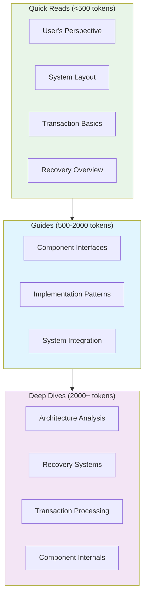

# Bedrock Documentation

The Bedrock distributed key-value store employs a carefully structured documentation system that serves both human developers and AI-assisted workflows. Our progressive disclosure approach ensures you receive the right depth of information for your current task without cognitive overload.

## Documentation Architecture

This documentation system organizes information across three precision-engineered tiers, each optimized for specific development contexts and cognitive loads:

### Progressive Information Access

**Quick Reads** deliver immediate conceptual understanding. Each article provides complete context for its scope while remaining under 500 tokens. Use these for rapid orientation, concept clarification, or when explaining Bedrock to others.

**Guides** contain actionable information for specific tasks. These 500-2000 token documents provide structured workflows, implementation patterns, and integration procedures. Reference these when building features or following established procedures.

**Deep Dives** offer comprehensive technical coverage with complete analysis, architectural reasoning, and implementation details. These extensive references support complex troubleshooting, architectural decisions, and thorough system understanding.

## Quick Reads (Tier 1)

Essential concepts delivered with precision and clarity. Each article provides complete understanding of its scope in under 500 tokens:

- **[User's Perspective](quick-reads/users-perspective.md)** - How developers interact with Bedrock's distributed transaction system
- **[Transaction System Layout](quick-reads/transaction-system-layout.md)** - Component architecture and data flow through the system
- **[Recovery Overview](quick-reads/recovery.md)** - System resilience and component coordination during failures  
- **[Transaction Basics](quick-reads/transactions.md)** - MVCC fundamentals, versioning, and commit coordination

## Implementation Guides (Tier 2)

Structured technical guidance for development tasks and system integration. These guides provide actionable workflows within 2000 tokens:

- **[Component Reference](components/README.md)** - Complete component architecture with interfaces and interaction patterns
- **[Control Plane Overview](quick-reads/control-plane-overview.md)** - Cluster coordination, recovery orchestration, and distributed consensus
- **[Data Plane Overview](quick-reads/data-plane-overview.md)** - Transaction processing, conflict resolution, and data persistence
- **[Implementation Components](components/implementations/)** - Concrete storage engines with performance characteristics

## Deep Dives (Tier 3)

Comprehensive technical analysis with complete coverage, architectural reasoning, and implementation details. These extensive references exceed 2000 tokens and provide authoritative coverage:

### System Architecture and Operations

- **[Architecture Analysis](deep-dives/architecture.md)** - Complete architectural patterns, component interactions, and design principles
- **[Recovery System](deep-dives/recovery.md)** - Fault tolerance, component coordination, and system resilience mechanisms  
- **[Transaction Processing](deep-dives/transactions.md)** - MVCC implementation, commit protocols, and conflict resolution strategies
- **[Cluster Startup](deep-dives/cluster-startup.md)** - Bootstrap sequences, coordinator election, and system initialization

### Recovery Subsystem Analysis

The recovery subsystem documentation provides detailed process flows for system resilience. These technical references are located in `quick-reads/recovery/` and cover specific recovery mechanisms:

- **[Log Recovery Planning](quick-reads/recovery/log-recovery-planning.md)** - Strategic planning for log reconstruction and consistency restoration
- **[Component Recruitment](quick-reads/recovery/log-recruitment.md)** - Service discovery and dynamic cluster membership management
- **[Storage Recruitment](quick-reads/recovery/storage-recruitment.md)** - Storage layer integration during recovery operations
- **[Component Startup Sequences](quick-reads/recovery/sequencer-startup.md)** - Detailed initialization protocols for core components
- **[State Persistence](quick-reads/recovery/persistence.md)** - Persistent state management and version determination algorithms

For comprehensive terminology and cross-referenced definitions, see the **[Complete Glossary](glossary.md)**.
