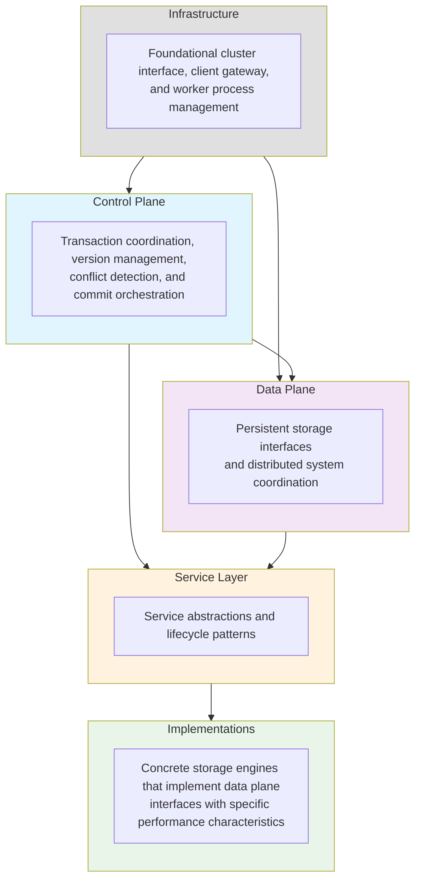

# Bedrock Components

This directory organizes Bedrock's components by their architectural role within the distributed database system. Each component implements specific responsibilities that work together to provide ACID transactions, MVCC concurrency control, and fault tolerance.

## Architecture Overview

Bedrock follows a layered architecture that separates concerns between transaction coordination, data persistence, and storage engine implementations:

## Control Plane Components

These components handle transaction lifecycle management, version assignment, and conflict resolution:

- **[Coordinator](control-plane/coordinator.md)** - Manages cluster state through Raft consensus and coordinates Director lifecycle
- **[Director](control-plane/director.md)** - Orchestrates recovery and epoch-based generation management for the transaction system
- **[Sequencer](control-plane/sequencer.md)** - The version authority that assigns globally unique, monotonically increasing version numbers for MVCC
- **[Transaction Builder](control-plane/transaction-builder.md)** - Constructs and validates transactions from client operations
- **[Commit Proxy](control-plane/commit-proxy.md)** - Orchestrates the two-phase commit protocol across log servers
- **[Resolver](control-plane/resolver.md)** - Detects conflicts between concurrent transactions using version analysis

The control plane implements the core transaction processing logic that ensures ACID properties and maintains consistency across the distributed system.

## Data Plane Components

These components provide the persistent storage interfaces and client connectivity:

- **[Proxy](data-plane/proxy.md)** - Read version proxy that forwards version requests to the authoritative Sequencer
- **[Log](data-plane/log.md)** - Persistent transaction log interface that maintains committed transaction history
- **[Storage](data-plane/storage.md)** - Multi-version key-value storage interface that serves read operations

The data plane defines the contracts between transaction processing and persistent storage, enabling different storage engine implementations while maintaining consistent behavior.

## Implementation Components

These are concrete storage engines that implement the data plane interfaces:

- **[Basalt](implementations/basalt.md)** - Multi-version storage engine optimized for read performance with MVCC support
- **[Shale](implementations/shale.md)** - Disk-based log implementation with write-ahead logging and segment file management

Implementation components can be swapped or configured based on performance requirements, hardware characteristics, and deployment constraints.

## Service Components

Service components provide abstractions and lifecycle patterns for the distributed system. Currently, service-level abstractions are integrated into other architectural layers.

## Infrastructure Components

These components provide foundational cluster interface, client gateway, and worker process management:

- **[Cluster](infrastructure/cluster.md)** - Foundational interface and configuration management for Bedrock distributed database instances
- **[Gateway](infrastructure/gateway.md)** - Client-facing interface that handles requests and routes them to appropriate components
- **[Foreman](infrastructure/foreman.md)** - Manages worker processes and service lifecycle operations across cluster nodes

Infrastructure components provide the high-level abstractions that applications use to interact with Bedrock clusters.

## Component Interactions

The components interact through well-defined interfaces that maintain architectural boundaries:

1. **Transaction Flow**: Client → Gateway → Transaction Builder → Commit Proxy → Log → Storage
2. **Version Management**: Sequencer provides versions to Transaction Builder and Commit Proxy
3. **Conflict Detection**: Resolver analyzes transactions using version information from Sequencer
4. **Data Persistence**: Commit Proxy writes to Log, Storage reads from Log to maintain local state

This separation enables independent scaling, testing, and evolution of each architectural layer while maintaining system-wide consistency and reliability.

## Navigation

Choose a component category to explore:

- **[Control Plane Components](control-plane/)** - Transaction coordination and version management
- **[Data Plane Components](data-plane/)** - Storage interfaces and distributed system coordination  
- **[Implementation Components](implementations/)** - Concrete storage engine implementations
- **[Service Components](service/)** - Service abstractions and lifecycle patterns
- **[Infrastructure Components](infrastructure/)** - Foundational cluster interface, client gateway, and worker management

For system-wide concepts, see the [Deep Dives](../deep-dives/) section which covers cross-component topics like recovery, transactions, and architectural patterns.
