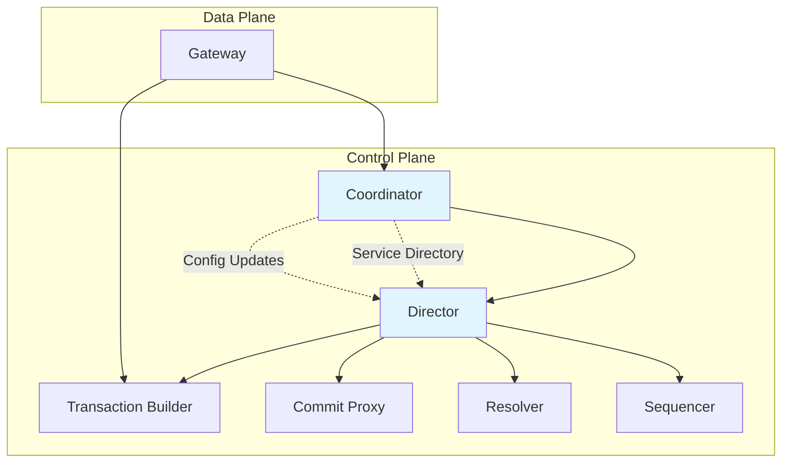

# Coordinator

The Coordinator maintains cluster state through Raft distributed consensus and orchestrates the lifecycle of Directors during leadership changes. It serves as the authoritative source for cluster configuration and service directory information across all nodes.

## Core Responsibilities

The Coordinator implements several critical functions within Bedrock's control plane:

### Distributed Consensus Management

- Maintains cluster configuration through Raft consensus protocol
- Persists transaction system layouts and service directories
- Ensures consistent state replication across all coordinator nodes
- Handles leader election and follower synchronization

### Service Directory Authority

- Receives service registrations from Gateway nodes across the cluster
- Maintains authoritative mapping of service IDs to node locations
- Propagates service directory updates through consensus to all coordinators
- Provides service discovery information to Directors during recovery

### Director Lifecycle Coordination

- Manages Director startup timing to prevent race conditions
- Implements leader readiness states to ensure proper service discovery
- Coordinates Director shutdown during leadership transitions
- Prevents split-brain scenarios through epoch-based generation management

## Architecture Integration

The Coordinator operates as part of Bedrock's control plane, working closely with other components:



The Coordinator sits at the top of the control plane hierarchy, providing foundational services that enable other components to discover and coordinate with each other effectively.

## Service Registration Flow

Bedrock's distributed service discovery follows a structured registration process:

1. **Node Startup**: Gateway processes start on cluster nodes and discover available services
2. **Service Advertisement**: Gateways call `register_gateway/4` or `register_services/2` on the current leader Coordinator
3. **Consensus Persistence**: The leader Coordinator persists service information through Raft consensus
4. **Cluster Propagation**: Service directory updates replicate to all Coordinator followers
5. **Director Notification**: Directors receive populated service directories for recovery orchestration

This design ensures that service topology information remains consistent across the cluster and survives coordinator failovers without data loss.

## Leader Readiness States

Coordinators implement a readiness state machine to prevent race conditions during leader transitions:

### `:leader_waiting_consensus`

- Initial state upon leader election
- Coordinator waits for first consensus round to complete
- Service directory populates from consensus log replay
- Director startup is delayed until readiness confirmation

### `:leader_ready`

- Activated after successful consensus round completion
- Service directory is populated and consistent
- Director can be safely started with complete cluster topology
- Normal cluster operations can proceed

This approach eliminates timing-dependent bugs where Directors might start before receiving complete service topology information.

## Key Operations

### Configuration Management

```elixir
# Fetch current cluster configuration
{:ok, config} = Coordinator.fetch_config(coordinator)

# Update cluster configuration through consensus
{:ok, txn_id} = Coordinator.update_config(coordinator, new_config)
```

### Service Directory Operations

```elixir
# Register multiple services from a gateway
services = [
  {"storage_1", :storage, {:bedrock_storage_1, node()}},
  {"log_1", :log, {:bedrock_log_1, node()}}
]
{:ok, txn_id} = Coordinator.register_services(coordinator, services)

# Register gateway with compact service info
{:ok, txn_id} = Coordinator.register_gateway(
  coordinator, 
  gateway_pid, 
  compact_services, 
  node_capabilities
)
```

### Transaction System Layout Management

```elixir
# Fetch current system layout
{:ok, layout} = Coordinator.fetch_transaction_system_layout(coordinator)

# Update system layout through consensus
{:ok, txn_id} = Coordinator.update_transaction_system_layout(coordinator, layout)
```

## Fault Tolerance Characteristics

The Coordinator provides several layers of fault tolerance:

**Consensus Durability**: All configuration and service directory changes persist through Raft consensus, surviving node failures and ensuring cluster-wide consistency.

**Leader Election**: Automatic leader election handles coordinator failures, with new leaders inheriting complete state from the consensus log.

**Service Discovery Resilience**: Service directory information replicates across all coordinators, eliminating single points of failure for service discovery.

**Graceful Director Transitions**: Leader readiness states ensure Directors always receive complete topology information, preventing partial recovery scenarios.

## Performance Considerations

Coordinator operations balance consistency with availability:

- **Consensus Overhead**: Configuration updates require consensus rounds, adding latency for consistency
- **Service Registration Batching**: Multiple services can register in single consensus operations
- **Read Scaling**: Service directory reads can be served from any coordinator node
- **Leader Locality**: Operations requiring consensus must route to the current leader

## See Also

- [Director](director.md) - Recovery orchestration managed by Coordinator
- [Gateway](../infrastructure/gateway.md) - Service registration and client interface  
- [Cluster Startup](../../deep-dives/cluster-startup.md) - Coordinator role in cluster initialization
- [Recovery](../../deep-dives/recovery.md) - Coordinator's role in recovery coordination
