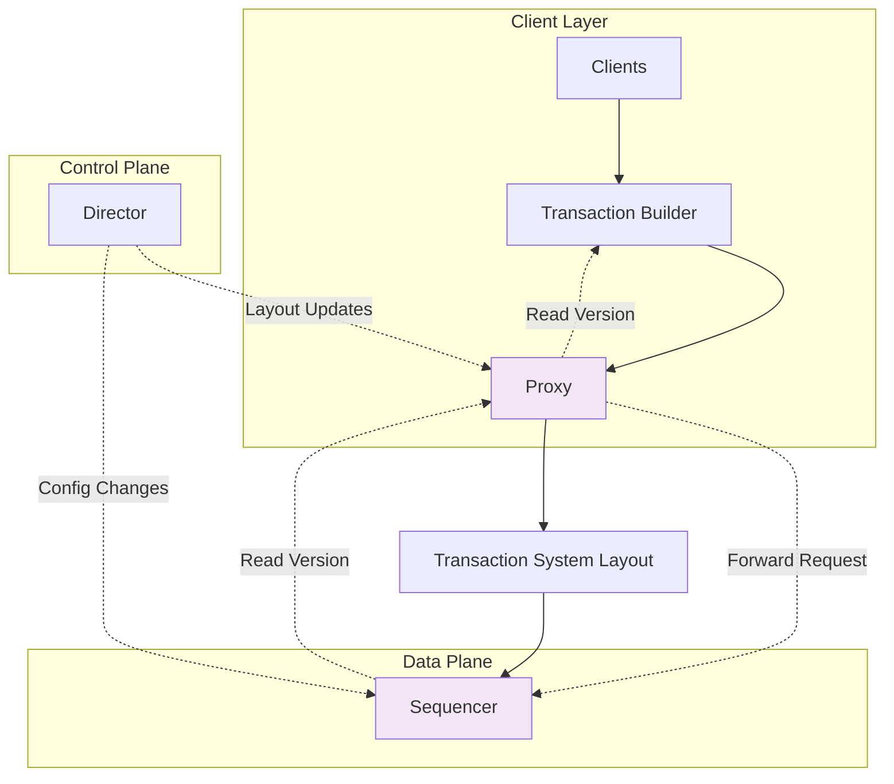

# Proxy

The Proxy provides read version forwarding for Bedrock's transaction system, serving as an intermediary that routes read version requests from clients to the authoritative Sequencer. It enables distributed read version allocation while maintaining the centralized version authority required for MVCC consistency.

## Core Responsibilities

The Proxy implements focused functionality within Bedrock's data plane:

### Read Version Forwarding
- Receives read version requests from transaction clients
- Forwards requests to the authoritative Sequencer process
- Maintains connection to current Sequencer for efficient routing
- Provides transparent proxy interface for version allocation

### Transaction System Integration
- Integrates with transaction system layout for Sequencer discovery
- Adapts to layout changes during recovery and reconfiguration
- Maintains Director reference for system-wide coordination
- Supports distributed transaction processing workflows

## Architecture Integration

The Proxy operates within Bedrock's data plane as a forwarding component:



The Proxy serves as a lightweight forwarding layer that maintains the centralized version authority while enabling distributed access patterns.

## Read Version Forwarding Flow

The Proxy implements a simple but effective forwarding protocol:

1. **Client Request**: Transaction Builder requests read version from Proxy
2. **Request Forwarding**: Proxy forwards call to configured Sequencer
3. **Version Allocation**: Sequencer allocates next available read version
4. **Response Relay**: Proxy relays version response back to client
5. **Transaction Continuation**: Client uses read version for transaction processing

This design maintains Sequencer authority while providing distributed access points across the cluster.

## Transaction System Layout Integration

The Proxy maintains awareness of transaction system topology:

### Layout Configuration
- Receives transaction system layout during initialization
- Maintains reference to current Sequencer process
- Adapts to layout changes during recovery operations
- Supports dynamic reconfiguration without service interruption

### Director Coordination
- Maintains reference to controlling Director process
- Receives layout updates through Director communication
- Participates in system-wide coordination during recovery
- Supports epoch-based generation management

## Key Operations

### Read Version Allocation
```elixir
# Request read version through proxy
read_version = Proxy.next_read_version(proxy)

# Proxy forwards to sequencer and returns result
# This maintains centralized version authority
# while providing distributed access
```

### Process Configuration
```elixir
# Proxy initialization with system layout
proxy_spec = Proxy.child_spec([
  id: "read_proxy_1",
  director: director_ref,
  layout: transaction_system_layout
])

# Layout contains sequencer reference for forwarding
%TransactionSystemLayout{
  sequencer: sequencer_service_id,
  # ... other components
}
```

## Performance Characteristics

The Proxy provides specific performance trade-offs:

### Forwarding Efficiency
- **Message Routing**: Single additional hop for read version requests
- **Connection Reuse**: Maintains persistent connection to Sequencer
- **Request Batching**: Individual requests maintain transaction semantics
- **Network Locality**: Can be deployed closer to clients for reduced latency

### Scalability Considerations
- **Stateless Design**: Proxy processes can be replicated across nodes
- **Load Distribution**: Multiple proxies can serve read version requests
- **Sequencer Bottleneck**: Ultimate throughput limited by Sequencer capacity
- **Recovery Adaptation**: Layout changes require proxy reconfiguration

## Fault Tolerance Characteristics

The Proxy provides lightweight fault tolerance:

**Stateless Operation**: Proxy processes maintain no persistent state, enabling rapid restart and replacement.

**Layout Adaptation**: Configuration changes during recovery enable proxy operation with new Sequencer assignments.

**Connection Management**: Proxy handles Sequencer connectivity issues through standard GenServer error handling.

**Process Supervision**: Proxy processes run under supervision with automatic restart capabilities.

## Deployment Patterns

The Proxy supports various deployment configurations:

### Co-located Deployment  
- Proxy processes run alongside Transaction Builder components
- Minimizes network hops for read version requests
- Provides node-local access to centralized version service

### Dedicated Proxy Nodes
- Proxy processes run on specialized forwarding nodes
- Enables separation of concerns between transaction processing and version allocation
- Supports high-throughput scenarios with dedicated proxy capacity

### Load Balancing
- Multiple proxy processes can serve read version requests
- Client connection balancing across available proxy instances
- Horizontal scaling of read version access points

## See Also

- [Sequencer](../control-plane/sequencer.md) - Authoritative version allocation service
- [Transaction Builder](../control-plane/transaction-builder.md) - Primary proxy client
- [Transactions Deep Dive](../../deep-dives/transactions.md) - Read version role in MVCC
- [Recovery](../../deep-dives/recovery.md) - Proxy reconfiguration during recovery