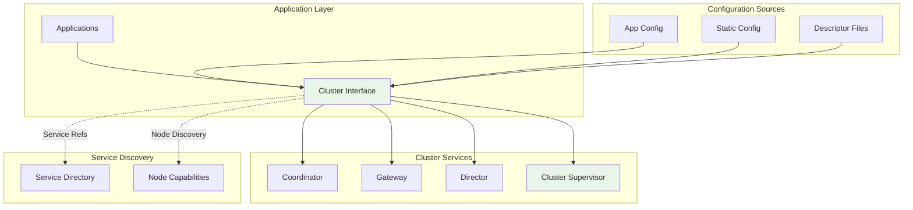

# Cluster

The Cluster provides the foundational interface and configuration management for Bedrock distributed database instances. It serves as the primary abstraction for cluster operations, offering a unified API for accessing cluster services, managing configuration, and coordinating distributed operations.

## Core Responsibilities

The Cluster implements several fundamental functions for distributed database operation:

### Cluster Interface Abstraction
- Provides unified API for accessing cluster services and components
- Abstracts node-specific details and service discovery complexity
- Offers consistent interface across different deployment configurations
- Enables application code to interact with cluster without topology knowledge

### Configuration Management
- Manages cluster configuration through application config or static definitions
- Provides access to transaction system layouts and service parameters
- Handles configuration updates and propagation across cluster nodes
- Supports both OTP application config and inline configuration options

### Service Discovery Integration
- Provides access to Coordinators, Gateways, and other cluster services
- Handles service reference resolution and connection management
- Offers both synchronous and asynchronous service access patterns
- Abstracts service location and failover complexity

## Architecture Integration

The Cluster operates as the top-level abstraction across all Bedrock components:



The Cluster interface sits at the top of the architecture, providing a single entry point for all cluster operations while hiding distributed system complexity.

## Cluster Definition and Usage

Clusters are defined using the `__using__` macro with configuration options:

### Application Config-Based Clusters
```elixir
defmodule MyApp.Cluster do
  use Bedrock.Cluster, 
    otp_app: :my_app,
    name: "production_cluster"
end

# Application configuration
config :my_app, MyApp.Cluster,
  coordinator_nodes: [:"node1@host1", :"node2@host2"],
  capabilities: [:coordination, :storage, :log],
  # ... other configuration
```

### Static Config-Based Clusters  
```elixir
defmodule MyApp.Cluster do
  use Bedrock.Cluster,
    name: "test_cluster",
    config: [
      coordinator_nodes: [Node.self()],
      capabilities: [:coordination, :storage, :log, :resolution],
      coordinator_ping_timeout_ms: 5000,
      gateway_ping_timeout_ms: 10000
    ]
end
```

This approach provides flexibility for different deployment scenarios while maintaining consistent interface patterns.

## Key Operations

### Configuration Access
```elixir
# Fetch cluster configuration
{:ok, config} = MyCluster.fetch_config()
config = MyCluster.config!()  # Raises on error

# Access node-specific configuration
node_config = MyCluster.node_config()
capabilities = MyCluster.node_capabilities()
```

### Service Discovery
```elixir
# Access cluster services
{:ok, coordinator} = MyCluster.fetch_coordinator()
coordinator = MyCluster.coordinator!()  # Raises on error

{:ok, gateway} = MyCluster.fetch_gateway()
{:ok, nodes} = MyCluster.fetch_coordinator_nodes()
```

### Transaction System Layout
```elixir
# Access transaction system configuration
{:ok, layout} = MyCluster.fetch_transaction_system_layout()
layout = MyCluster.transaction_system_layout!()

# Layout contains service assignments
%TransactionSystemLayout{
  sequencer: "sequencer_1",
  commit_proxy: "proxy_1", 
  resolver: "resolver_1",
  logs: ["log_1", "log_2"],
  storage_teams: [storage_team_configs]
}
```

### OTP Integration
```elixir
# Generate OTP names for cluster components
cluster_name = MyCluster.otp_name()          # :bedrock_my_cluster
coordinator_name = MyCluster.otp_name(:coordinator)  # :bedrock_my_cluster_coordinator
gateway_name = MyCluster.otp_name(:gateway)         # :bedrock_my_cluster_gateway

# Worker-specific naming
worker_name = MyCluster.otp_name_for_worker("storage_1")  # :bedrock_my_cluster_worker_storage_1
```

## Configuration Sources and Precedence

The Cluster supports multiple configuration approaches:

### OTP Application Configuration
- Traditional Elixir application configuration in `config.exs`
- Runtime configuration support through `runtime.exs`
- Environment-specific configuration with config overrides
- Integration with release configuration management

### Static Configuration
- Inline configuration provided directly in cluster definition
- Useful for testing and development scenarios
- Allows configuration without external config files
- Supports dynamic cluster creation in runtime scenarios

### Descriptor Files
- File-based configuration for deployment flexibility
- Default location in `priv/bedrock.cluster`
- Configurable path through application configuration
- Supports configuration updates without code changes

## Node Capability Management

Clusters manage node capabilities for service placement:

### Capability Types
- **`:coordination`**: Node can run Coordinator processes
- **`:storage`**: Node can host storage workers
- **`:log`**: Node can host log workers  
- **`:resolution`**: Node can run conflict resolution services

### Capability Configuration
```elixir
# Configure node capabilities
config :my_app, MyApp.Cluster,
  capabilities: [:coordination, :storage, :log]

# Access capabilities at runtime
capabilities = MyCluster.node_capabilities()
```

## Timeout and Performance Configuration

Clusters provide configurable timeouts for different operations:

### Coordinator Communication
- `coordinator_ping_timeout_ms`: Timeout for coordinator ping operations
- Balances failure detection speed with network variability
- Affects coordinator leadership detection timing

### Gateway Communication  
- `gateway_ping_timeout_ms`: Timeout for gateway-director communication
- Controls how quickly gateways detect director failures
- Influences cluster reconfiguration responsiveness

## Fault Tolerance Characteristics

The Cluster interface provides several fault tolerance features:

**Service Reference Caching**: Service references are cached and refreshed on failure, reducing discovery overhead.

**Configuration Fallback**: Multiple configuration sources provide fallback options when primary sources are unavailable.

**Graceful Degradation**: Operations return error tuples rather than crashing when services are unavailable.

**Timeout Management**: Configurable timeouts prevent operations from hanging indefinitely during network issues.

## See Also

- [Coordinator](../control-plane/coordinator.md) - Primary cluster service accessed through Cluster interface
- [Gateway](../data-plane/gateway.md) - Client interface managed by Cluster
- [Cluster Startup](../../deep-dives/cluster-startup.md) - Cluster initialization process
- [Recovery](../../deep-dives/recovery.md) - Cluster interface role in recovery coordination