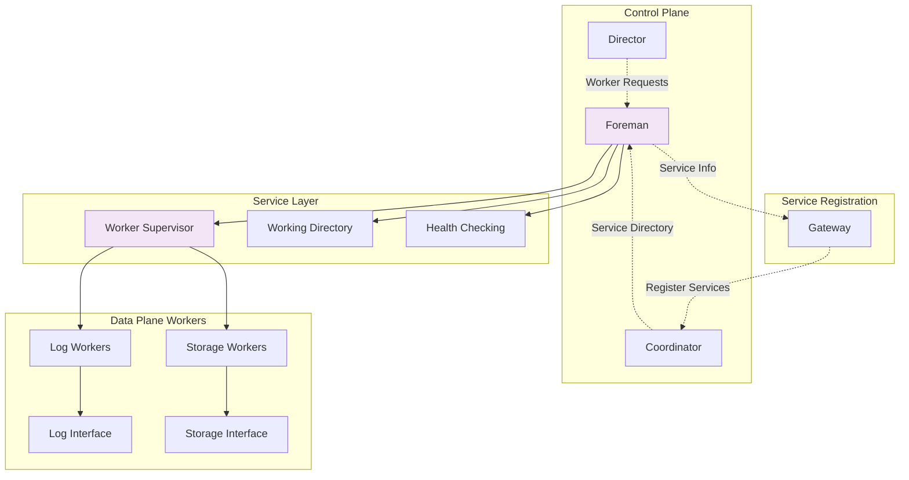

# Foreman

The Foreman manages worker processes and service lifecycle operations across cluster nodes. It provides centralized control over the creation, monitoring, and removal of storage and log workers that implement Bedrock's data plane services.

## Core Responsibilities

The Foreman implements several critical functions for service management:

### Worker Process Management
- Creates new log and storage worker processes on demand
- Maintains registry of all running workers with health status
- Provides worker discovery and enumeration capabilities
- Coordinates worker shutdown and cleanup operations

### Service Lifecycle Operations
- Handles worker startup sequencing and dependency management
- Monitors worker health and reports status to the cluster
- Manages working directory creation and cleanup
- Coordinates service registration with cluster coordinators

### Resource Management
- Supervises worker processes through OTP supervision trees
- Manages working directories and persistent storage locations
- Provides batch operations for efficient worker management
- Implements graceful shutdown procedures with resource cleanup

## Architecture Integration

The Foreman operates as a bridge between the control plane and data plane:



The Foreman sits between cluster orchestration and actual data services, translating high-level service requests into concrete worker processes.

## Worker Management Flow

The Foreman implements a structured workflow for worker lifecycle management:

1. **Creation Request**: Director or administrator requests new worker creation
2. **Resource Allocation**: Foreman allocates working directory and process resources
3. **Process Startup**: Worker process starts under supervision with proper configuration
4. **Health Verification**: Foreman waits for worker to report healthy status
5. **Service Registration**: Worker information is made available for cluster registration
6. **Ongoing Monitoring**: Continuous health monitoring with status reporting

This approach ensures workers are fully operational before being advertised to the cluster.

## Service Discovery Integration

Foremanprocesses coordinate with cluster service discovery:

### Service Information Provision
- Maintains authoritative list of running services on each node
- Provides compact service information for coordinator registration
- Maps internal worker processes to cluster-visible service identifiers
- Supports both individual and batch service registration operations

### Health Status Propagation
- Workers report health status to their local Foreman
- Foreman aggregates health information across all managed workers
- Provides cluster-wide health checking capabilities
- Enables automated recovery when workers become unhealthy

## Key Operations

### Worker Creation and Management
```elixir
# Create a new storage worker
{:ok, worker_ref} = Foreman.new_worker(foreman, "storage_1", :storage)

# Create a new log worker  
{:ok, worker_ref} = Foreman.new_worker(foreman, "log_1", :log)

# List all running workers
{:ok, workers} = Foreman.all(foreman)

# List only storage workers
{:ok, storage_workers} = Foreman.storage_workers(foreman)
```

### Health Monitoring
```elixir
# Wait for all workers to report healthy
:ok = Foreman.wait_for_healthy(foreman, timeout: 30_000)

# Workers report health to their foreman
:ok = Foreman.report_health(foreman, worker_id, :ok)
:ok = Foreman.report_health(foreman, worker_id, {:error, reason})
```

### Service Registration Support
```elixir
# Get service information for coordinator registration
{:ok, services} = Foreman.get_all_running_services(foreman)

# Services returned as compact tuples
[
  {"storage_1", :storage, :bedrock_storage_1},  
  {"log_1", :log, :bedrock_log_1}
]
```

### Worker Cleanup Operations
```elixir
# Remove single worker with cleanup
:ok = Foreman.remove_worker(foreman, "storage_1")

# Batch remove multiple workers
results = Foreman.remove_workers(foreman, ["storage_1", "storage_2", "log_1"])
# Returns: %{"storage_1" => :ok, "storage_2" => :ok, "log_1" => :ok}
```

## Working Directory Management

The Foreman manages persistent storage locations for workers:

### Directory Structure
- Each worker receives a dedicated working directory
- Directories persist worker configuration and data files
- Directory cleanup occurs during worker removal
- Failed cleanup operations are reported with detailed error information

### Cleanup Operations
- Worker termination triggers working directory cleanup
- Batch operations process multiple workers efficiently
- Error handling preserves system state on partial failures
- Directory removal failures include POSIX error codes and paths

## Health Monitoring System

Foreman implements comprehensive health monitoring:

### Worker Health States
- **`:ok`**: Worker is operational and ready for service
- **`{:failed_to_start, reason}`**: Worker failed during startup
- **`:starting`**: Worker is in startup phase
- **`:unknown`**: Health status is not yet determined

### Aggregated Health Checking
- Foreman tracks health status for all managed workers
- `wait_for_healthy/2` blocks until all workers report healthy
- Health transitions are logged and made available to cluster monitoring
- Failed workers can trigger automated recovery procedures

## Fault Tolerance Characteristics

The Foreman provides several layers of fault tolerance:

**Process Supervision**: Workers run under OTP supervision trees with automatic restart capabilities.

**Health Monitoring**: Continuous health checking enables rapid failure detection and response.

**Graceful Cleanup**: Worker removal includes proper resource cleanup and state management.

**Batch Operations**: Multiple worker operations are atomic, reducing partial failure scenarios.

**Error Propagation**: Detailed error information supports automated recovery decision-making.

## Performance Considerations

Foreman operations balance reliability with performance:

- **Supervision Overhead**: Worker supervision adds memory and CPU overhead but provides fault isolation
- **Health Check Frequency**: Monitoring intervals balance failure detection speed with system load
- **Batch Operations**: Multi-worker operations reduce message passing and improve efficiency
- **Working Directory I/O**: Directory operations can impact worker startup and shutdown performance
- **Service Registration Batching**: Compact service information reduces coordinator communication overhead

## See Also

- [Director](../control-plane/director.md) - Orchestrates worker creation through Foreman
- [Storage](../data-plane/storage.md) - Storage workers managed by Foreman
- [Log](../data-plane/log.md) - Log workers managed by Foreman  
- [Gateway](../data-plane/gateway.md) - Service registration coordination
- [Recovery](../../deep-dives/recovery.md) - Foreman role in cluster recovery