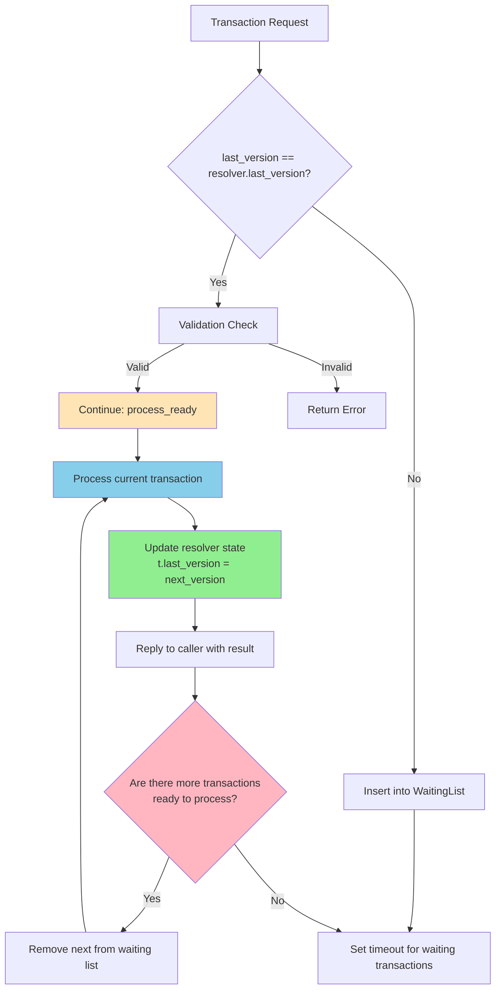

# Resolver

The [Resolver](../../../glossary.md#resolver) implements Bedrock's [Multi-Version Concurrency Control (MVCC)](../../../glossary.md#multi-version-concurrency-control) [conflict](../../../glossary.md#conflict) detection, serving as the arbiter that determines which [transactions](../../../glossary.md#transaction) can safely [commit](../../../glossary.md#commit) together. Each Resolver covers a specific [key range](../../../glossary.md#key-range) and maintains [version](../../../glossary.md#version) history to detect when transactions would violate serialization if allowed to proceed.

**Location**: [`lib/bedrock/data_plane/resolver/server.ex`](../../../lib/bedrock/data_plane/resolver/server.ex)

## Optimistic Concurrency and Conflict Detection

Bedrock uses [Optimistic Concurrency Control (OCC)](../../../glossary.md#optimistic-concurrency-control), where transactions proceed without acquiring locks and conflicts are detected only at commit time. This approach maximizes concurrency and eliminates deadlocks, but it requires sophisticated conflict detection to maintain correctness. The fundamental challenge is determining whether a set of transactions, if committed together, would produce a result equivalent to some serial execution of those same transactions.

Resolvers detect two primary types of conflicts that can violate serializability. Read-write conflicts occur when a transaction reads a key, then another transaction commits a write to that same key before the first transaction commits—the reading transaction based its decisions on stale data. Write-write conflicts happen when two transactions attempt to write to overlapping key ranges, which would produce arbitrary results depending on [storage](../../../glossary.md#storage) server timing.

## Version History Through Interval Trees

Resolvers maintain an interval tree that tracks which key ranges were written at which versions. This structure enables efficient conflict detection by answering whether any writes occurred to overlapping key ranges after a transaction's [read version](../../../glossary.md#read-version). The tree must be carefully pruned to prevent unbounded memory growth by removing entries for versions older than the [minimum read version](../../../glossary.md#minimum-read-version) across active transactions.

The [Commit Proxy](../../../glossary.md#commit-proxy) handles all key range partitioning and routing, sending each Resolver only the transactions relevant to its assigned key space. Resolvers don't need to know their specific key ranges—they simply process whatever transactions they receive, trusting that the Commit Proxy has already performed the necessary filtering based on the [transaction system layout](../../../glossary.md#transaction-system-layout) established during [recovery](../../../glossary.md#recovery).

## Resolution Process and Abort Strategy

When a Resolver receives a [batch](../../../glossary.md#batch) of transactions from the Commit Proxy, it processes each transaction in order to detect conflicts. For read-write conflicts, it checks whether any read keys overlap with key ranges that were written after the transaction's read version. For write-write conflicts, it identifies cases where multiple transactions attempt to modify overlapping key ranges.

When conflicts are detected, transactions are processed in order and conflicting transactions are simply added to an aborted list by their index position. This preserves transaction arrival order and provides predictable behavior.

The resolution process produces a list of transaction indices that must be aborted due to conflicts. The Commit Proxy uses this information to notify affected clients while allowing non-conflicting transactions to proceed to the logging phase.

### Transaction Processing Flow

In normal operation, Resolvers expect transactions to arrive in version order. When transactions arrive out of order, the Resolver maintains a waiting queue indexed by version number, holding later transactions until earlier versions are processed. This ensures consistent conflict detection regardless of network timing variations.

The Resolver follows a precise flow for handling transactions that arrive both in-order and out-of-order:

**Key Processing Phases:**

1. **Version Ordering Check**: Transactions with `last_version == resolver.last_version` are validated and accepted immediately, while out-of-order transactions are queued in the waiting list.

2. **Deferred Processing**: Valid immediate transactions trigger background processing via continuation, ensuring all conflict resolution happens in the unified processing loop.

3. **Unified Processing Loop**: All actual transaction processing (conflict resolution, state updates) happens in a single `process_ready` continuation that processes the current transaction and all ready waiting transactions in sequence.

4. **Single State Update Point**: The resolver's `last_version` is updated in only one place within the processing loop, eliminating duplication and ensuring consistency.

5. **Batch Processing**: The loop continues processing waiting transactions until no more are ready, maximizing throughput by processing all available work in one continuation chain.

6. **Timeout Management**: Waiting transactions are tracked with configurable timeouts (default 30 seconds) to prevent resource accumulation and provide predictable failure modes when dependency versions are delayed.

## Implementation Architecture

The Resolver is implemented as a modular system centered around the `Bedrock.DataPlane.Resolver.Server` GenServer, with specialized modules handling different aspects of conflict resolution:

### Core Modules

- **`Resolver.Server`**: Main GenServer managing resolver state and transaction processing flow
- **`Resolver.State`**: State management structure tracking version history and waiting transactions
- **`Resolver.Tree`**: AVL tree-based interval structure for efficient conflict detection
- **`Resolver.Validation`**: Transaction format validation ensuring Transaction compliance
- **`Resolver.ConflictResolution`**: Core conflict detection algorithms for read-write and write-write conflicts
- **`Resolver.Telemetry`**: Telemetry events for monitoring and performance tracking
- **`Resolver.Tracing`**: Debug tracing support for development and troubleshooting

### Transaction Format Integration

The Resolver operates on Transaction binary format rather than simple transaction maps. This provides several advantages:

- **Efficient Section Extraction**: Only conflict-relevant sections (read_conflicts, write_conflicts, commit_version) are extracted without full transaction decode
- **Format Validation**: Transactions are validated for proper Transaction format compliance before processing
- **Space Efficiency**: Binary format reduces memory overhead and network transfer costs
- **Self-Describing Sections**: Tagged sections with embedded CRC validation ensure data integrity

Conflict detection operates directly on the extracted conflict ranges from Transaction sections, allowing the Resolver to process transactions efficiently without needing the full mutation data.

## Validation System

The Resolver incorporates a comprehensive validation system that ensures transaction format compliance and data integrity:

### Transaction Format Validation

All incoming transactions must conform to the Transaction binary format:

- **Magic Number Verification**: Validates "BRDT" magic number and format version
- **Section Integrity**: Verifies section headers, sizes, and CRC32 checksums
- **Required Sections**: Ensures conflict detection sections are present and properly formatted
- **Range Format Validation**: Validates conflict range encoding and key ordering

Validation failures result in immediate transaction rejection with detailed error reporting through telemetry events. This prevents malformed transactions from corrupting resolver state or causing processing errors.

### Version Ordering Validation

The Resolver enforces strict version ordering requirements:

- **Sequential Processing**: Transactions must arrive with `last_version` equal to the resolver's current `last_version`
- **Gap Detection**: Out-of-order transactions are queued in the waiting list with timeout tracking
- **Consistency Checks**: Version progression is validated to prevent state corruption

Validation errors are distinguished between format issues (permanent failures) and ordering issues (temporary queueing), enabling appropriate handling for each scenario.

## Observability and Monitoring

The Resolver provides comprehensive observability through telemetry events and optional debug tracing:

### Telemetry Events

The `Resolver.Telemetry` module emits detailed events throughout the transaction resolution process:

**Core Processing Events:**

- `:received` - Transaction batch received with version information
- `:processing` - Transaction batch validation and conflict resolution started
- `:completed` - Resolution completed with abort counts and final versions
- `:reply_sent` - Response transmitted to commit proxy

**Waiting List Events:**

- `:waiting_list` - Out-of-order transactions added to waiting queue
- `:waiting_list_inserted` - Queue insertion completed with current size
- `:waiting_resolved` - Waiting transactions processed after dependency completion

**Error Events:**

- `:validation_error` - Transaction format or content validation failures
- `:waiting_list_validation_error` - Validation errors for queued transactions

Each event includes measurements (transaction counts, abort counts) and metadata (versions, queue sizes) enabling detailed performance monitoring and debugging.

### Debug Tracing

The `Resolver.Tracing` module provides optional debug logging that can be enabled during development:

- **Structured Logging**: Formatted log messages with consistent resolver context
- **Version Tracking**: Detailed version progression through transaction processing
- **Performance Metrics**: Transaction counts and processing timing information
- **Error Context**: Detailed error information for troubleshooting validation failures

Tracing can be started/stopped dynamically and attaches to all resolver telemetry events, providing comprehensive visibility into resolver operations without impacting production performance when disabled.

## Integration with the Transaction System

Resolvers integrate closely with the Commit Proxy, which coordinates the overall transaction commit process. The Commit Proxy sends batches of Transaction-encoded transactions to the appropriate Resolvers based on key ranges, then aggregates their responses to determine which transactions can proceed.

The Resolver's conflict detection algorithms ensure strict serializability in Bedrock's optimistic concurrency control system. By maintaining precise version history through interval trees and operating on validated Transaction format, Resolvers can efficiently determine when transaction conflicts would violate the required serialization order while providing comprehensive observability into the resolution process.

## Component-Specific Responsibilities

Resolver serves as the **MVCC conflict detection authority** with these specific responsibilities:

- **Interval Tree Management**: Maintains AVL tree-based interval structures tracking key range write history
- **Conflict Detection**: Identifies read-write and write-write conflicts using version history analysis
- **Range-Based Processing**: Handles specific key ranges for distributed, scalable conflict detection
- **Batch Processing**: Processes multiple transactions together to detect intra-batch conflicts
- **Memory Management**: Prunes old version history based on minimum read version to prevent unbounded growth
- **Recovery State Reconstruction**: Rebuilds conflict detection state from committed transaction logs during recovery

> **Complete Flow**: For the full transaction processing sequence showing Resolver's role in context, see **[Transaction Processing Deep Dive](../../../deep-dives/transactions.md)**.

## Related Components

- **[Commit Proxy](commit-proxy.md)**: Coordinates conflict resolution and provides transaction data to Resolvers
- **[Sequencer](sequencer.md)**: Provides version ordering that enables consistent conflict detection
- **[Storage](storage.md)**: Provides key range assignments and transaction data for state recovery
- **[Director](../control-plane/director.md)**: Control plane component that manages Resolver recovery and range assignment
