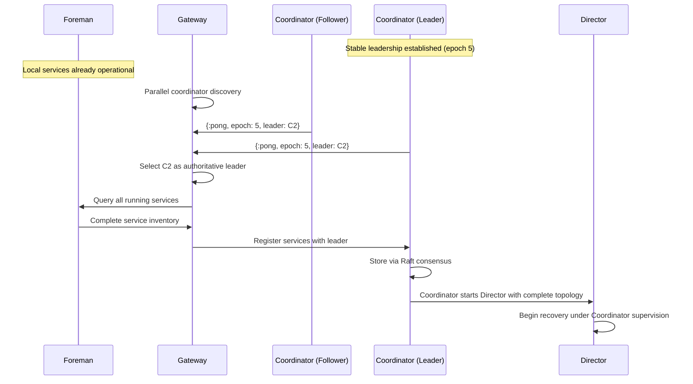
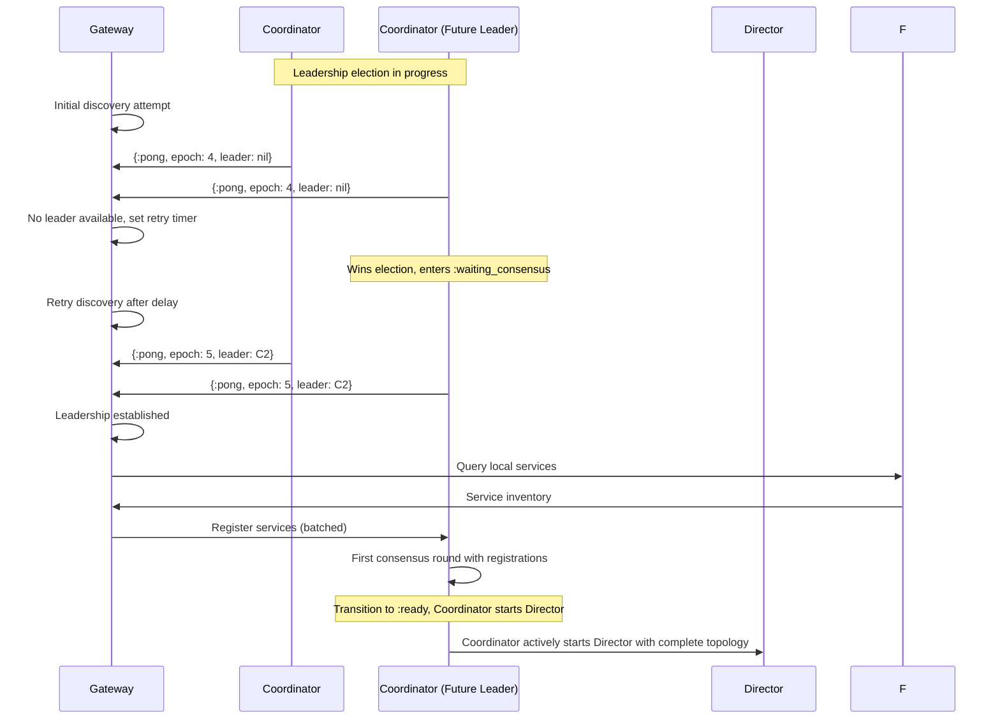
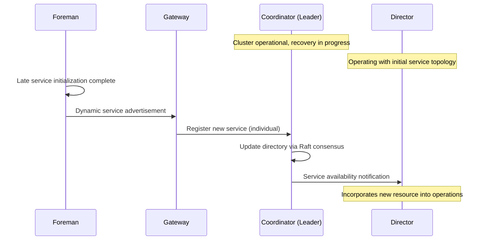
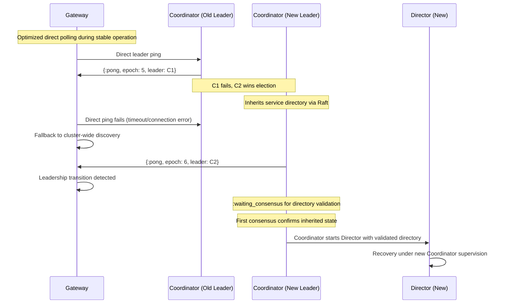
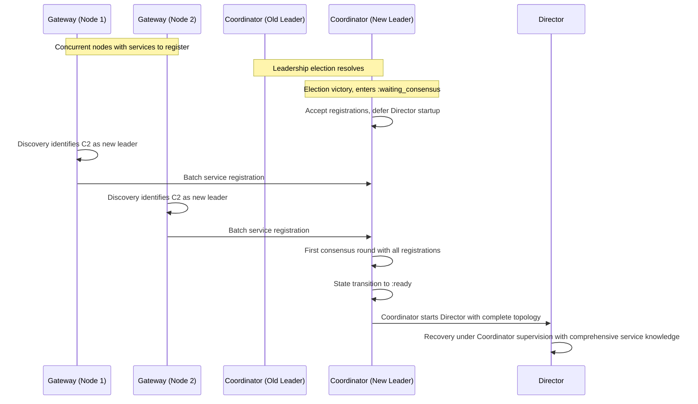

# Cluster Startup: The Distributed Coordination Challenge

**How distributed nodes bootstrap themselves into a coherent transaction processing system.**

Before [recovery](recovery.md) can rebuild a failed Bedrock cluster, the distributed nodes must solve a fundamental coordination problem: establishing shared authority and complete resource visibility across an uncertain network. This bootstrapping process transforms individual, isolated processes into a unified system capable of [distributed transaction processing](transactions.md), handling everything from pristine cluster initialization to complex leader failover scenarios.

## The Bootstrap Coordination Problem

Distributed system startup confronts a classic chicken-and-egg problem: nodes require authoritative coordination to form a cluster, but authoritative coordination requires an established cluster. Traditional approaches often rely on external coordination services or complex consensus protocols that introduce additional failure modes and operational complexity.

Bedrock solves this through a Raft-based consensus system where Coordinator processes establish authoritative leadership and orchestrate cluster formation. This coordinator-driven approach handles the full spectrum of startup scenarios—from clean deployments to partial failures during ongoing operations—while maintaining the same failure-recovery philosophy that guides the overall system design.

## Essential Coordination Elements

Every Bedrock cluster must establish two critical elements before transaction processing can begin:

**Authoritative Leadership**: One Coordinator must possess exclusive authority to make cluster-wide decisions, manage [epoch](../glossary.md#epoch) transitions, and coordinate [recovery](recovery.md) processes. Without clear leadership, competing coordinators could make conflicting decisions that compromise data consistency.

**Complete Service Topology**: The system requires comprehensive knowledge of all available services across all nodes—their capabilities, locations, and operational status. Incomplete topology information leads to suboptimal resource allocation and potential recovery failures when services go unrecognized.

The startup system coordinates these elements through Raft consensus and active coordinator management that adapts to different timing scenarios while preventing the race conditions that plague traditional distributed bootstrapping approaches.

## The Coordinator-Driven Architecture

Bedrock's startup coordination operates through a robust Raft-based consensus system where Coordinator processes establish authoritative leadership and actively orchestrate cluster formation. This architecture proves resilient across diverse timing scenarios while maintaining the deterministic behavior needed for reliable distributed operation.

The pattern centers on the Coordinator processes, which implement comprehensive Raft consensus with persistent state storage via DETS. Once a Coordinator is elected leader, it actively manages cluster startup by accepting service registrations, coordinating timing through leader readiness states, and directly starting and supervising the Director process.

[Gateway](architecture/infrastructure/gateway.md) components serve as reactive discovery clients that find the elected Coordinator leader and register their local services. Rather than driving the process, Gateways respond to the coordinator-established infrastructure by discovering leadership and connecting to the centrally managed cluster state.

This approach provides several critical advantages: it ensures deterministic startup ordering through Raft consensus, provides persistent leadership state across failures, and centralizes coordination logic in the well-understood Coordinator processes. The system handles network partitions, variable startup timing, and partial component failures through proven distributed consensus mechanisms.

## Startup Scenario Analysis

### Scenario 1: Joining an Established Cluster

The most straightforward startup scenario occurs when nodes join a cluster with stable Coordinator leadership already established. In this case, the coordination challenge reduces to efficient leader discovery and service registration with the established coordinator-managed infrastructure.

## Leader Discovery Through Coordinator Polling

The [Gateway](architecture/infrastructure/gateway.md) discovers the current leader by polling known coordinators, seeking the established Raft leader. This discovery approach works efficiently because Raft followers can immediately identify the current leader, while the leader identifies itself. The Gateway selects the coordinator reporting the highest [epoch](../glossary.md#epoch) number, which provides definitive leader identification even during brief leadership transitions.

## Service Registration with Coordinator

Once the Coordinator leader is identified, the Gateway queries its local Foreman for all running services and registers them with the Coordinator. This registration provides the Coordinator with the service inventory needed for cluster coordination. The Coordinator stores this information through Raft consensus and uses it to make informed decisions about when to start the [Director](../glossary.md#director) with complete topology information.

**Implementation Details**:

- Coordinator discovery: `GenServer.multi_call(nodes, :coordinator, :ping, timeout)`
- Service inventory: `Foreman.get_all_running_services(timeout: 1_000)`
- Service registration: `Coordinator.register_services(coordinator, services)`
- Coordinator state management: Raft consensus with DETS persistence

### Scenario 2: Coordination During Leadership Elections

The more complex scenario occurs when nodes bootstrap while Raft leadership elections are still in progress among Coordinators. This timing creates a coordination challenge where Gateways must discover leadership that doesn't yet exist, requiring retry logic while the Coordinator consensus system resolves leadership.

## Polling Strategy During Elections

When leadership elections are active, coordinators respond to discovery polls with `nil` for the leader field—indicating the election remains unresolved. Rather than failing immediately, Gateways implement exponential backoff retry logic, continuing discovery attempts until leadership stabilizes. This resilient approach doesn't assume specific election timing but simply waits for the cluster to establish clear authority.

## Coordinator Leader Readiness Protocol

The critical timing challenge emerges when a Coordinator wins the Raft election: the new leader must coordinate carefully with service registration from other nodes before starting the [Director](../glossary.md#director). Without proper synchronization, the Coordinator might start the Director with incomplete service topology, missing resources that are still registering from other nodes.

Bedrock solves this through a two-phase leader readiness protocol implemented in the Coordinator: newly elected leaders enter a `:waiting_consensus` state where they accept service registrations but defer Director startup until their first Raft consensus round completes. This ensures the Coordinator has complete information before actively starting [recovery](recovery.md) processes.

### Scenario 3: Dynamic Service Registration

Distributed systems rarely achieve perfect timing synchronization—services may start at different rates across nodes, creating situations where initial cluster coordination completes while additional services are still initializing. Bedrock handles this through dynamic service advertisement that enables continuous topology updates without disrupting ongoing operations.

## Post-Coordination Service Discovery

After Coordinator leadership stabilizes and initial [recovery](recovery.md) begins, late-starting services can still join the cluster seamlessly. When the local Foreman detects new services becoming operational, it advertises them to the local [Gateway](architecture/infrastructure/gateway.md). The Gateway registers these services with the Coordinator leader, which updates the service directory through Raft consensus and actively notifies the [Director](../glossary.md#director).

This dynamic registration enables the Director to incorporate newly available resources into ongoing [recovery](recovery.md) operations or future [transaction system layouts](../quick-reads/transaction-system-layout.md), ensuring that all available resources contribute to system capacity and fault tolerance.

**Implementation Notes**:

- Service advertisement: Internal Foreman notification to Gateway
- Individual registration: `Coordinator.register_services(coordinator, [service_info])`
- Coordinator notification: `GenServer.cast(director, {:service_registered, service_info})`
- Persistent storage: Service directory maintained via Raft/DETS

### Scenario 4: Leader Failover Coordination

Leader failover represents the most sophisticated coordination scenario, combining Raft leadership election dynamics with service directory preservation. This scenario tests the resilience of the Coordinator-managed system while maintaining service topology consistency across leadership transitions.

## Adaptive Polling Strategy

During normal operation, Gateways optimize for efficiency by polling the known leader directly rather than broadcasting to all coordinators. When the leader fails, these direct polls fail, triggering an automatic fallback to full cluster discovery mode. This two-phase approach optimizes for the common case—stable leadership—while maintaining resilience for failure scenarios without requiring complex failure detection logic.

## Service Directory Inheritance Through Raft

The new Coordinator leader inherits the complete service directory through Raft state replication and DETS persistence, eliminating the need for services to re-register after leadership changes. This inheritance mechanism proves crucial for maintaining uninterrupted cluster operations during leadership transitions. However, the new Coordinator leader still implements the same `:waiting_consensus` protocol used during initial elections, ensuring the inherited directory reflects the current cluster state before actively starting [Director](../glossary.md#director) operations.

**Implementation Details**:

- Direct polling: `GenServer.call(coordinator, :ping, timeout)`
- Cluster discovery: `GenServer.multi_call(nodes, :coordinator, :ping, timeout)`

## Critical Timing Coordination: The Service Registration Race

The most sophisticated challenge in distributed cluster startup occurs when leadership elections coincide with concurrent service registration attempts across multiple nodes. This scenario exposes a fundamental race condition that could compromise [recovery](recovery.md) effectiveness if not handled carefully.

## The Registration Race Hazard

Without proper coordination, a newly elected Coordinator leader might immediately start the [Director](../glossary.md#director) upon winning the Raft election, before service registrations from other nodes complete their propagation through Raft consensus. This timing creates a dangerous race condition where the Coordinator starts [recovery](recovery.md) with incomplete service topology information, potentially missing available resources that are still in transit through the consensus protocol.

The hazard becomes particularly acute during system-wide failures where multiple nodes restart simultaneously—each node's [Gateway](architecture/infrastructure/gateway.md) attempts service registration with the new Coordinator leader at roughly the same time, creating a burst of concurrent Raft operations that must complete before [recovery](recovery.md) can safely begin.

## Bedrock's Coordinator Solution

Bedrock resolves this race through the two-phase leader readiness protocol implemented in the Coordinator. Newly elected Coordinator leaders enter `:waiting_consensus` state immediately upon Raft election, accepting service registrations but deferring [Director](../glossary.md#director) startup until their first Raft consensus round completes with all pending registrations.

**Implementation Mechanisms**:

- Leader state management: `put_leader_startup_state/2` in Coordinator
- Consensus completion trigger: `:raft, :consensus_reached` message enables Director startup

This Coordinator-implemented protocol ensures that [recovery](recovery.md) never begins with incomplete information, regardless of the complex timing interactions between Raft leadership elections and service registration across multiple nodes.

## The Foundation for Reliable Recovery

Cluster startup transforms a collection of individual processes into a coordinated distributed system ready for reliable [recovery](recovery.md) operations. This transformation occurs through systematic resolution of the fundamental coordination challenges that plague distributed system bootstrapping.

## Coordination Success Criteria

Successful cluster startup establishes three essential guarantees that enable effective [recovery](recovery.md):

**Unambiguous Authority**: Exactly one Coordinator possesses leadership authority with a current [epoch](../glossary.md#epoch), eliminating competing decision-makers that could compromise [recovery](recovery.md) consistency.

**Complete Resource Visibility**: The [Director](../glossary.md#director) receives comprehensive knowledge of all available services across the cluster, ensuring [recovery](recovery.md) planning can utilize every available resource for fault tolerance and performance.

**Coordinated Timing**: The two-phase readiness protocol ensures the [Director](../glossary.md#director) starts only after all concurrent service registration completes, preventing race conditions that could compromise [recovery](recovery.md) effectiveness.

## The Coordinator-Managed Recovery Initiation

With these guarantees established, the Coordinator leader actively starts the [recovery](recovery.md) process, which transforms the raw service inventory into a functioning [transaction processing system](transactions.md). The Coordinator provides [recovery](recovery.md) with a stable foundation—clear Raft-based leadership, complete resource knowledge, and coordinated timing—while supervising and managing the systematic reconstruction of distributed database infrastructure.

This clear separation of concerns allows each component to focus on its essential challenge: the Coordinator handles distributed consensus and coordination, while the [Director](../glossary.md#director) handles distributed systems reconstruction under Coordinator supervision. Together, they transform system failure into reliable operation through well-defined, Raft-based protocols.

## Related Components and Processes

- **[Recovery Architecture](recovery.md)**: The comprehensive reconstruction process that follows successful cluster startup
- **[Gateway Component](architecture/infrastructure/gateway.md)**: Node-level coordination and service registration
- **[Transaction System Layout](../quick-reads/transaction-system-layout.md)**: The coordination blueprint created during recovery
- **[Architecture Overview](architecture.md)**: System-wide architectural context for startup coordination

## Implementation References

- **Coordinator State Management**: `lib/bedrock/control_plane/coordinator.ex`
- **Gateway Discovery Logic**: `lib/bedrock/cluster/gateway/discovery.ex`
- **Service Registration**: `lib/bedrock/cluster/gateway/worker_advertisement.ex`
- **Director Recovery Interface**: `lib/bedrock/control_plane/director/recovery.ex`
