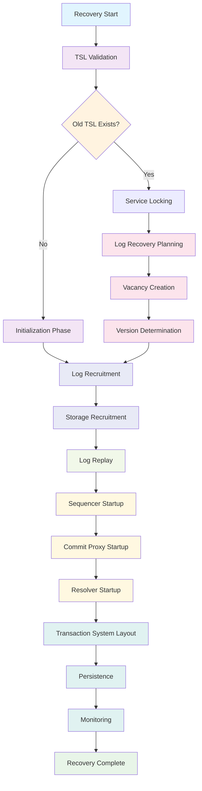

# Bedrock Recovery

**For comprehensive details and deeper context, see the [Recovery Guide](../deep-dives/recovery.md).**

## Recovery Flow

## Recovery Phases

Recovery proceeds through a carefully orchestrated sequence of phases, each building upon the previous one:

### Foundation Phases

0. **[TSL Validation](recovery/tsl-validation.md)** - Validate type safety of recovered TSL data structure
1. **[Service Locking](recovery/service-locking.md)** - Establish exclusive control over old system services (includes path determination logic)

### Data Recovery Path

2. **[Log Recovery Planning](recovery/log-recovery-planning.md)** - Determine what transaction data can be safely recovered
3. **[Vacancy Creation](recovery/vacancy-creation.md)** - Plan the new system architecture with placeholders
4. **[Version Determination](recovery/version-determination.md)** - Establish the recovery baseline for durable data

### Service Recruitment

5. **[Log Recruitment](recovery/log-recruitment.md)** - Assign real services to log vacancy placeholders
6. **[Storage Recruitment](recovery/storage-recruitment.md)** - Assign real services to storage vacancy placeholders

### Data Migration

7. **[Log Replay](recovery/log-replay.md)** - Copy committed transactions to new log services

### Component Startup

8. **[Sequencer Startup](recovery/sequencer-startup.md)** - Start the global version number authority
9. **[Commit Proxy Startup](recovery/proxy-startup.md)** - Deploy commit proxy components for horizontal transaction scalability
10. **[Resolver Startup](recovery/resolver-startup.md)** - Start MVCC conflict detection components

### System Finalization

11. **[Transaction System Layout](recovery/transaction-system-layout.md)** - Create the coordination blueprint
12. **[Persistence](recovery/persistence.md)** - Durably store configuration via system transaction
13. **[Monitoring](recovery/monitoring.md)** - Establish operational monitoring and mark recovery complete

## Recovery Entry Point

Recovery begins when the Director creates a `RecoveryAttempt` with the current timestamp, cluster configuration, and epoch. This initialization occurs in `RecoveryAttempt.new/3` and establishes the timing baseline for the entire recovery process. The recovery attempt tracks all state changes as recovery progresses through its phases, starting with TSL validation to ensure type safety before proceeding to service coordination.

## Implementation References

- **Main Recovery Module**: `lib/bedrock/control_plane/director/recovery.ex`
- **Phase Implementations**: `lib/bedrock/control_plane/director/recovery/*_phase.ex`
- **Recovery Attempt State**: `lib/bedrock/control_plane/config/recovery_attempt.ex`

## See Also

- [Recovery Deep Dive](../deep-dives/recovery.md) - Comprehensive recovery system analysis
- [Bedrock Architecture](../deep-dives/architecture.md) - Overall system architecture
- [Components Documentation](../deep-dives/architecture/README.md) - Individual component details
- [Transaction System Layout](transaction-system-layout.md) - System coordination blueprint
