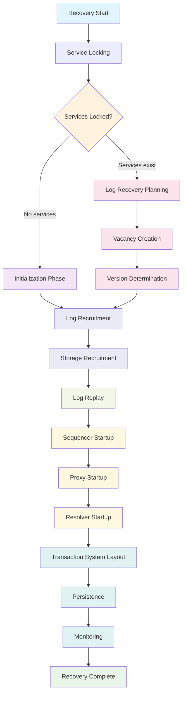

# Bedrock Recovery

**For comprehensive details and deeper context, see the [Recovery Guide](../01-guides/recovery-guide.md).**

## Recovery Flow

## Recovery Phases

Recovery proceeds through a carefully orchestrated sequence of phases, each building upon the previous one:

### Foundation Phases
1. **[Service Locking](recovery/service-locking.md)** - Establish exclusive control over old system services
2. **[Path Determination](recovery/path-determination.md)** - Decide between new cluster initialization or data recovery

### Data Recovery Path
3. **[Log Recovery Planning](recovery/log-recovery-planning.md)** - Determine what transaction data can be safely recovered
4. **[Vacancy Creation](recovery/vacancy-creation.md)** - Plan the new system architecture with placeholders
5. **[Version Determination](recovery/version-determination.md)** - Establish the recovery baseline for durable data

### Service Recruitment
6. **[Log Recruitment](recovery/log-recruitment.md)** - Assign real services to log vacancy placeholders
7. **[Storage Recruitment](recovery/storage-recruitment.md)** - Assign real services to storage vacancy placeholders

### Data Migration
8. **[Log Replay](recovery/log-replay.md)** - Copy committed transactions to new log services

### Component Startup
9. **[Sequencer Startup](recovery/sequencer-startup.md)** - Start the global version number authority
10. **[Proxy Startup](recovery/proxy-startup.md)** - Start commit proxy components for scalability
11. **[Resolver Startup](recovery/resolver-startup.md)** - Start MVCC conflict detection components

### System Finalization
12. **[Transaction System Layout](recovery/transaction-system-layout.md)** - Create the coordination blueprint
13. **[Persistence](recovery/persistence.md)** - Durably store configuration via system transaction
14. **[Monitoring](recovery/monitoring.md)** - Establish operational monitoring and mark recovery complete

## Recovery Entry Point

Recovery begins when the Director creates a `RecoveryAttempt` with the current timestamp, cluster configuration, and epoch. This initialization occurs in `RecoveryAttempt.new/3` and establishes the timing baseline for the entire recovery process. The recovery attempt tracks all state changes as recovery progresses through its phases.

## Implementation References

- **Main Recovery Module**: `lib/bedrock/control_plane/director/recovery.ex`
- **Phase Implementations**: `lib/bedrock/control_plane/director/recovery/*_phase.ex`
- **Recovery Attempt State**: `lib/bedrock/control_plane/director/recovery_attempt.ex`

## See Also

- [Recovery Deep Dive](../deep-dives/recovery.md) - Comprehensive recovery system analysis
- [Bedrock Architecture](../deep-dives/architecture.md) - Overall system architecture
- [Components Documentation](../components/) - Individual component details
- [Transaction System Layout](transaction-system-layout.md) - System coordination blueprint